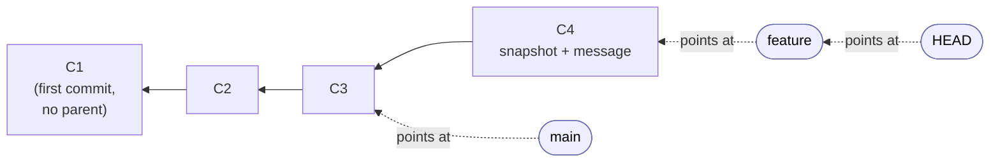
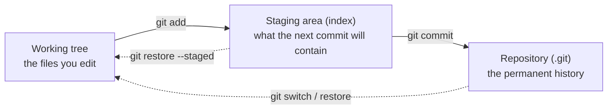
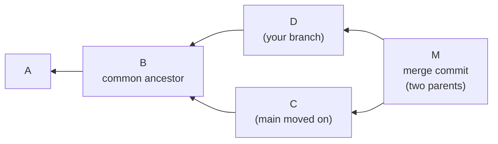
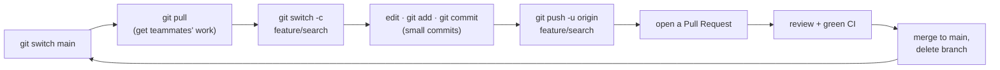

# Chapter 8 — Version Control with Git

> **Where we are.** Chapters 1–7 taught you to decide *what* to build and how to
> structure it: process, requirements, use cases, design, architecture. All of that
> produces *code* — and the moment code exists, a problem appears that no amount of good
> design solves on its own. More than one person will change it. Even working alone, you
> will change it across weeks, take a wrong turn, and need to get back to something that
> worked. You will want to know who wrote a line and why, try a risky idea without
> endangering what already runs, and combine your work with a teammate's without either of
> you losing an afternoon. A **version control system** makes all of that safe and
> routine, and for essentially the whole industry that system is **Git**. Every discipline
> in the rest of this book sits on top of it: the code reviews of Chapter 9 happen on Git
> branches, the delivery pipeline of Chapter 14 runs on every Git commit, and the team
> project of Appendix A is impossible to coordinate without it.

Git is close to universal. In recent Stack Overflow developer surveys roughly 93–94% of
professional developers report using it,[^1] and the platforms built on it — GitHub,
GitLab, and others — are where modern software is written, reviewed, and shipped. Yet Git
also has a reputation for being hard to learn, and the reputation is earned: its commands
are famously inconsistent, and a small, elegant idea hides behind an interface that leaks
its own internals.[^2] This chapter takes a clear position: the cure for the confusion is
not memorizing commands but building the right *mental model* first. Once you know what
Git actually stores, the commands stop being incantations and start being obvious.

> **Principle.** Version control is the substrate of collaboration. You cannot review,
> integrate continuously, test on every change, or ship safely as a team until every
> change has a name, a history, and an owner. That is precisely what version control gives
> you, and it is why this chapter comes before the quality and delivery chapters that
> depend on it.

## 8.1 Why Version Control

### 8.1.1 Life Without It

Picture a shared folder that has grown these files over a week:

```
report.docx        report_final.docx          report_FINAL_jing_use_this.docx
report_v2.docx     report_final_ACTUAL.docx
```

Everyone has lived some version of this. It
is the manual, error-prone answer to a real need — keeping old versions around in case you
have to go back — and Pro Git calls the copy-into-a-timestamped-folder approach exactly
that: *error-prone*, because "it is easy to forget which directory you're in and
accidentally write to the wrong file or copy over files you don't mean to."[^3]

Now make it code, and make it a team. Two people edit the same file and email copies back
and forth; the second person to save wins, and the first person's afternoon is gone. A
change three weeks ago introduced a bug, but nobody can say which change, or why it was
made, or what the file looked like before. Someone wants to try a bold refactor but is
afraid to, because there is no safe way back if it fails. These are not tooling
annoyances; they are the daily friction that makes software built by more than one person
hard. A **version control system (VCS)** is, in Pro Git's words, "a system that records
changes to a file or set of files over time so that you can recall specific versions
later."[^3] It gives you four things the shared folder cannot: a complete **history** you
can travel back through, **attribution** so you can see who changed a line and read why,
**isolation** so you can experiment without endangering working code, and **integration**
so several people can change the same project at once and combine the results on purpose
rather than by luck.

Early systems solved pieces of this. Local tools such as RCS tracked a single developer's
file history on one machine. Centralized systems — CVS, then Subversion (SVN), then
Perforce — put all the versioned files on one server that clients check out from, which
finally let a team collaborate and gave administrators fine-grained control.[^4] But a
central server is a single point of failure: if it is down, as Pro Git notes, "nobody can
collaborate at all or save versioned changes," and if its disk is lost without a backup,
"you lose absolutely everything — the entire history of the project."[^4] That weakness is
what the next generation was built to remove.

### 8.1.2 What Git Is

**Git** is a **distributed** version control system. When you `git clone` a project you do
not check out the latest files the way you would from a central server; you "fully mirror
the repository, including its full history."[^4] Every clone is a complete, independent
backup. Any developer's copy can restore a dead server, you can commit and browse history
on a plane with no network, and there is no single machine everyone must be able to reach
to get work done.

Git was written in a hurry for a serious job. In early 2005 the Linux kernel project lost
free use of BitKeeper, the proprietary distributed system it had relied on, after a licence
dispute.[^5] Linus Torvalds started writing a replacement on 3 April 2005, announced it on
the 6th, had it hosting its own source the next day, and used it to manage the Linux kernel
2.6.12 release that June; he handed maintenance to Junio Hamano — still the maintainer
today — a few months later.[^5] Torvalds set four goals: avoid everything he disliked about
CVS, support a distributed BitKeeper-style workflow, provide "very strong safeguards
against corruption," and be *fast*.[^5] (He also, by his own cheerful admission, named it
after himself; the manual page calls Git "the stupid content tracker.")

Two design decisions from that origin explain almost everything about how Git behaves. The
first is that **Git stores snapshots, not differences.** Older systems store, per file, a
list of changes over time — a base version plus a stack of diffs you add up to reconstruct
any version. Git instead "thinks of its data more like a series of snapshots": every commit
records a picture of *all* your files at that moment, and for any file that did not change,
it stores "a link to the previous identical file it has already stored."[^6] The second is
that **everything is checksummed.** Git names each piece of content by the SHA-1 hash of
the content itself — a 40-character fingerprint — and stores it under that name rather than
under a filename.[^6] You cannot change a file, or a commit, without changing its hash, so
corruption cannot hide, and identical content is automatically stored only once. (Git is
migrating from SHA-1 to SHA-256 following a 2017 demonstration that SHA-1 collisions are
feasible, but the idea is unchanged.)

### 8.1.3 How to Think About Git: A Graph of Snapshots

Here is the model that makes the rest of the chapter easy. Underneath, Git is a key-value
store: hand it content, it hashes the content and hands back the fingerprint. Three kinds
of object are built on that store.[^7] A **blob** holds the contents of one file. A **tree**
maps names to blobs and other trees — it is a snapshot of a directory. A **commit** points
to one top-level tree (the snapshot of your whole project), carries an author, a timestamp,
and a message, and points back to its **parent** commit — the state the project was in just
before. The first commit has no parent; a normal commit has one; a merge has two or more.

Follow those parent pointers backward and you are walking the project's history. Because a
commit can have several children (two people build on the same starting point) and a merge
has several parents, the shape this makes is not a straight line but a **directed acyclic
graph (DAG)** of snapshots. "History" in Git is just this graph, read backward.



The arrows between commits run from child to parent: each commit knows where it came from.
A **branch** is the last piece, and it is smaller than beginners expect. A branch "is
simply a lightweight movable pointer" to one commit — literally a small file containing a
40-character hash.[^8] Creating a branch costs about 41 bytes; that is why Git users make
branches constantly and older tools, which copied the whole project into a new folder to
branch, made people dread it. **HEAD** is one more pointer: it points at the branch you are
currently on. When you commit, the commit is created with your current commit as its
parent, and the branch HEAD points at slides forward to the new commit. Branches do not
"contain" commits and have no built-in parent-child relationship to each other; they are
just sticky notes you peel off and re-stick onto newer commits as you work.

> **Pitfall.** The single most common misconception is that *Git stores diffs.* It stores
> whole snapshots keyed by content hash. Nearly every later confusion — why branching is
> instant, why merging and rebasing behave the way they do, why nothing is ever really
> lost — dissolves once you picture commits as snapshots in a graph rather than as a pile
> of edits.[^2]

## 8.2 The Everyday Workflow

### 8.2.1 Setting Up Once

Before your first commit, tell Git who you are, because that name and email are stamped
onto every commit you make:

```
git config --global user.name "Your Name"
git config --global user.email "you@example.com"
```

You get a repository in one of two ways. If the project already exists on a server, copy it
and its whole history to your machine with `git clone <url>`.[^9] If you are starting fresh
locally, run `git init` inside your project directory to create the hidden `.git/`
subdirectory that holds the object database — then, when you are ready to share it, connect
it to a remote with `git remote add origin <url>` and `git push -u origin main`.

A note on the default branch name. Historically Git's first branch was called `master`;
modern Git and GitHub create it as `main` instead. Both are ordinary branches with no
special powers — wherever this chapter says `main`, use whatever your repository's default
branch is called. Finally, pushing to a service like GitHub requires authentication:
GitHub removed account-password authentication in 2021, so the two normal paths are HTTPS
with a **personal access token** (which you paste in place of a password) or an **SSH key**
you generate once and add to your account.

### 8.2.2 The Three Areas

Every change flows through three places, and understanding them is the thing that most
separates people who are comfortable with Git from people who fight it. The **working tree**
is the ordinary directory of files you edit. The **repository** (`.git/`) is the committed
history. Between them sits the piece with no equivalent in Dropbox or a "Save" button: the
**staging area**, also called the **index**, which holds exactly the changes that will go
into your next commit.[^10]



Why an intermediate step? Because a commit should be one coherent change, and your working
tree is usually a mess of several. Staging lets you compose the next commit deliberately —
these three files, this part of a fourth — rather than dumping everything you happened to
touch. The everyday loop is: **edit** files in the working tree, **stage** the pieces you
want with `git add`, and **commit** the staged snapshot to history.

### 8.2.3 Recording Changes

`git status` is the command you will run more than any other; it shows what is untracked,
what is modified but unstaged, and what is staged and ready to commit.[^11] `git add <file>`
stages a file's *current* content into the index. `git commit` records the staged snapshot
as a new commit — either opening an editor for the message or taking it inline with
`git commit -m "..."`.

```
git status                         # what changed, and what is staged
git add src/login.py               # stage this file's current content
git add -p                         # stage selected chunks, interactively
git commit -m "Fix redirect loop on expired session"
git log --oneline --graph          # see history as a labeled graph
git diff                           # unstaged changes (working tree vs. index)
git diff --staged                  # what the next commit will record
```

The staging area is also where beginners get their first genuine surprise, so it is worth
seeing once on purpose. If you `git add` a file and then edit it again, the *newer* edits
are not in the commit — the commit records what was staged at add-time, not what is in the
working tree now. `git status` will helpfully list the file as both "staged" and "modified"
to tell you so. This is not a bug; it is the whole point of staging being a separate step.
The shortcut `git commit -a -m "..."` auto-stages every already-*tracked* modified file and
commits in one move, which is convenient but skips exactly the deliberate selection that
makes staging useful — and it silently omits brand-new files, which are not yet tracked.[^11]

> **Pitfall.** "`git commit` saved my files" and "`git commit -a` captures everything" are
> both false in ways that bite. A commit records only what is *staged*, and `-a` stages
> only files Git is already tracking. Run `git status` before you commit until reading it
> is second nature.

### 8.2.4 What Not to Track: `.gitignore`

Not everything in your working directory belongs in history. Compiled output, dependency
folders like `node_modules/`, editor scratch files, and — most importantly — secrets such
as API keys and passwords should never be committed. You tell Git to ignore them with a
`.gitignore` file listing patterns (`*.log`, `build/`, `.env`) at the repository root.[^12]

Two facts about `.gitignore` cause real damage when learned too late. First, it only
affects files Git is *not already tracking.* Adding a path to `.gitignore` does nothing to a
file you already committed; to stop tracking it you must `git rm --cached <file>` and commit
that removal. Second, and far more serious: **Git history is forever.** Deleting a secret in
a new commit does not remove it — it still sits in every earlier commit, every clone, and
every fork. If you commit a credential, the credential is compromised the moment it is
pushed; rotate it immediately, and only then scrub it from history with a tool such as
`git filter-repo`.[^13]

> **Principle.** Create `.gitignore` *first*, before your first `git add .`. It is far
> cheaper to never commit a secret or a build artifact than to purge one from history after
> the fact.

### 8.2.5 Undoing Things Safely

Git's reputation for danger is mostly undeserved, but it has a real basis: a few commands
change your working files and a few rewrite history, and beginners reach for the dangerous
ones by accident. The commands sort cleanly by *which of the three areas they touch*.[^14]

| To… | Use | Touches | Safe? |
|---|---|---|---|
| Discard unstaged edits to a file | `git restore <file>` | working tree | destructive (edits gone) |
| Unstage a file, keep the edits | `git restore --staged <file>` | index | safe |
| Fix the *last* (unpushed) commit | `git commit --amend` | last commit | safe if not pushed |
| Undo an old commit with a new one | `git revert <hash>` | adds a commit | safe, shareable |
| Move a branch back, keep edits | `git reset --soft` / `--mixed` | history + index | recoverable |
| Move a branch back, discard edits | `git reset --hard <hash>` | all three | destructive |

Two ideas make this manageable. **`git revert`** is the collaboration-safe undo: instead of
erasing an old commit, it adds a *new* commit that reverses it, so history stays intact for
everyone who already has it. And the safety net beneath all of it is **`git reflog`**, which
records every position `HEAD` has held. Because Git "generally only adds data," committed
work is almost impossible to truly lose; when you think you have destroyed something, the
answer is usually `git reflog` to find the commit's hash and `git reset --hard <hash>` (or
`git branch recover <hash>`) to get it back — not deleting the folder and re-cloning in
despair.[^15]

> **Pitfall.** Never `--amend`, `reset`, or force-push a commit you have already shared. You
> are not editing your copy; you are rewriting history other people have built on, and their
> next pull becomes a mess. Rewrite freely *before* you push; treat pushed history as
> public record.

## 8.3 Branching and Merging

### 8.3.1 A Branch Is a Pointer

Because a branch is just a movable pointer (§8.1.3), making one is instant and free, and
that cheapness is what enables Git's whole style of work: open a branch for every feature or
experiment, and keep the shared `main` branch clean. The commands split the two things the
old, overloaded `git checkout` used to do — creating/switching branches and discarding file
changes — into the clearer modern pair `git switch` and `git restore`, introduced in Git
2.23.[^16]

```
git branch                 # list branches; * marks the one you are on (HEAD)
git switch -c add-search   # create a new branch and move onto it
# ...edit and commit; the add-search pointer advances, main stays put...
git switch main            # back to main (working tree updates to its snapshot)
```

When you switch, `HEAD` moves to the named branch and your working tree is rewritten to that
branch's snapshot; when you commit, the branch you are on advances to the new commit while
every other branch stays exactly where it was.

### 8.3.2 Merging

Eventually you want the work on a branch back in `main`. `git merge` does this, and it takes
one of two shapes.[^17] If `main` has not moved since you branched, Git can simply slide the
`main` pointer forward to your branch's latest commit — a **fast-forward**, no new commit
needed. If `main` *has* moved (a teammate merged something meanwhile), Git performs a
**three-way merge**: it finds the common ancestor of the two branches, combines the two sets
of changes, and records the result as a new **merge commit** with *two* parents — one on
each branch.



The merge commit is not clutter; it is an honest record that two lines of development came
together here, and it is what lets Git combine work that others based on either side.

### 8.3.3 Merge or Rebase?

There is a second way to combine branches, and the choice between them is one of the few
genuine debates in everyday Git. **`git rebase`** takes the commits on your branch and
*replays* them, one at a time, on top of the latest `main`, as if you had started your work
from there.[^18] The result is a straight, linear history with no merge commit — which many
teams find easier to read. The cost is that rebasing creates *new* commits (same changes,
new hashes): it rewrites history. That leads to the one rule you must not break.

> **Principle — the Golden Rule of Rebasing.** Never rebase commits that exist outside your
> own local repository — that is, commits you have already pushed and others may have.[^19]
> Rebase your *own* unpushed work to tidy it before sharing; use *merge* to integrate work
> that is already public. Break this rule and you force everyone else into a painful
> reconciliation of two divergent histories.

A useful default for a student team: rebase your short-lived feature branch onto the latest
`main` before you open a pull request (so your changes sit cleanly on top of current work),
and let the final integration into `main` be a merge.

## 8.4 Working with Others

### 8.4.1 Remotes

A **remote** is another copy of the repository, usually the shared one on GitHub, and by
convention it is named `origin`. Four commands move commits between your machine and it.[^20]
`git clone` copies a remote and its history down for the first time. `git fetch` downloads
new commits from the remote but does *not* change your working files — it just updates your
view of where the remote's branches are (the `origin/*` "remote-tracking" branches).
`git pull` is `git fetch` followed by a merge (or rebase) of those new commits into your
current branch. `git push` uploads your commits to the remote.

The moment every beginner hits is the **rejected push**:

```
 ! [rejected]        main -> main (fetch first)
error: failed to push some refs to '...'
hint: Updates were rejected because the remote contains work that you
hint: do not have locally.
```

This is not an error so much as Git protecting a teammate's work: someone pushed to `main`
after you last pulled, and blindly overwriting the remote would discard their commits. The
fix is always the same — `git pull` (integrate their work into yours, resolving any
conflict), then `git push`. Never reach for `git push --force` to make the message go away
on a shared branch; that is exactly the overwrite Git was preventing.

### 8.4.2 The Daily Team Loop

Put the pieces together and a team's day has a rhythm. Almost every task follows the same
loop, and internalizing it as one motion is more valuable than any single command.



1. Start from an up-to-date `main` (`git switch main`, then `git pull`).
2. Branch for the task with a descriptive name (`git switch -c feature/search`).
3. Do the work in small commits; push the branch early
   (`git push -u origin feature/search`), both to back it up and to let others see it.
4. Open a **pull request**, get it reviewed and past CI, and merge it into `main`.
5. Delete the branch and return to step 1.

### 8.4.3 Pull Requests and Code Review

A **pull request (PR)** — GitLab calls it a *merge request* — is the ritual that turns "I
changed some code" into "the team accepted this change." You push a branch, open a PR
proposing to merge it into `main`, request reviewers, and a conversation happens on the
diff: reviewers comment, may "request changes," and you push more commits to the same branch
until it is approved. The PR is where the code review of Chapter 9 actually takes place, and
where the continuous-integration pipeline of Chapter 14 reports whether your change passes
the tests and checks.

There are two shapes of PR depending on your access. If you have write access to the shared
repository — a normal student team — you push a branch to it directly and open the PR from
there (the **branch-and-PR** model). If you do not — the usual case when contributing to
someone else's open-source project — you **fork** the repository to your own account, push
your branch there, and open the PR across from your fork to the original (the **fork-and-PR**
model).

This is also the answer to a question every team asks: *why can't I just push to `main`?*
Because `main` is a **protected branch**. On a well-run project, GitHub is configured to
reject direct pushes to `main` and to require that every change arrive through a PR that has
an approving review (§9.3) and a passing CI run (§14.2) before it can merge.[^21] That single
setting is what turns "we should review our code" from a good intention into something the
system actually enforces.

### 8.4.4 Team Workflows and Their Trade-offs

A **workflow** is your team's shared convention for how work leaves a laptop and becomes
part of the product. Four are worth knowing, and — this matters — they are *not* equally
good for a modern web project.

**Trunk-based development** keeps one shared mainline (the *trunk*, i.e. `main`) that every
developer integrates into at least daily, using only very short-lived branches that live
hours to a day or two.[^22] Incomplete work is hidden behind **feature flags** rather than
kept on a long branch. This is the workflow the research literature associates with elite
delivery performance, precisely because frequent integration keeps merges tiny.[^23]

**GitHub Flow** (feature-branch workflow) is the lightly-more-structured version most
student teams should use: `main` is always deployable, you branch for each change, open a
PR, review, and merge.[^24] It keeps the PR-and-review ritual while staying close to
trunk-based development if the branches stay short.

**Gitflow** deserves a specific warning. For years it was *the* answer — a memorable diagram
with five kinds of branch (`main`, `develop`, `feature`, `release`, `hotfix`).[^25] It suits
software that ships in discrete, versioned releases, but it is heavyweight for anything
continuously deployed, and its own author added a note in 2020 walking it back for
web teams that "deliver continuously."[^25] If your instinct is that "the Git workflow"
means Gitflow, unlearn that; it is a specialized tool, not the default.

**The forking workflow** is how open source runs: contributors have no write access, so each
forks the canonical repository, works in their fork, and proposes changes by PR.[^26]

| Workflow | Branches | Best for | Watch out for |
|---|---|---|---|
| Trunk-based | trunk + hours-long | continuously deployed products, strong CI | needs feature flags to hide incomplete work |
| GitHub Flow | `main` + short feature branches | most teams, including student projects | let branches live too long and merges hurt |
| Gitflow | `main`, `develop`, +3 kinds | versioned, scheduled releases | overkill and slow for continuous delivery |
| Forking | one fork per contributor | open source, untrusted contributors | extra step to sync your fork with upstream |

> **Pitfall.** Long-lived feature branches are the single most common cause of "merge
> hell." A branch that diverges from `main` for three weeks accumulates three weeks of
> conflicts to untangle at the worst possible moment. Whatever workflow you choose, keep
> branches short and integrate often — this is the most reliable conflict-prevention
> technique there is.

## 8.5 Merge Conflicts

### 8.5.1 What Causes a Conflict

A **merge conflict** is Git admitting it cannot safely combine two changes on its own, so it
stops and hands the decision to you. It happens when the two branches being merged changed
the *same lines* of the same file in different ways, or when one side edited a file the
other deleted.[^27] When Git can see that two changes touch different regions, it merges them
silently; a conflict is specifically the case where the changes overlap and only a human can
say what the combined result should be.

It is important to know what Git does *not* catch. It detects *textual* overlap, not
*semantic* incompatibility. If you rename a function on your branch while a teammate adds a
new call to the old name on theirs, and the two edits are in different files, Git merges them
without complaint — and the build breaks. Conflicts are the visible disagreements; the
invisible ones are why review and tests still matter after a clean merge.

### 8.5.2 Reading the Markers

When a conflict happens, Git pauses the merge and rewrites the conflicted region of the file
with markers showing both versions:[^27]

```
<<<<<<< HEAD
price = subtotal * 1.08          # our change: 8% tax
=======
price = subtotal * 1.095         # their change: 9.5% tax
>>>>>>> feature/tax-update
```

Read it as three parts. Everything between `<<<<<<< HEAD` and `=======` is **"ours"** — the
version on the branch you are currently on. Everything between `=======` and `>>>>>>>` is
**"theirs"** — the version coming in from the branch you are merging. The label after
`>>>>>>>` names that incoming branch. A one-time configuration,
`git config --global merge.conflictstyle zdiff3`, adds a third section showing the common
**ancestor** — what the line said *before* either change — which usually makes the right
resolution obvious.

> **Pitfall.** "Ours" and "theirs" are relative to what you checked out, and they *flip*
> between a merge and a rebase (because a rebase replays your commits onto their branch, so
> "ours" becomes the branch you are landing on). When in doubt, do not guess from the label
> — read the actual content and the ancestor.

### 8.5.3 Resolving One, Step by Step

The resolution is less mysterious than the markers make it look:[^28]

1. Run `git status` — conflicted files are listed under "Unmerged paths."
2. Open each one and edit the conflicted region into the single result you actually want —
   which may be ours, theirs, a blend, or something new. **Delete all three marker lines**
   (`<<<<<<<`, `=======`, `>>>>>>>`) as you go.
3. Stage the resolved file with `git add <file>` — staging *is* how you tell Git a file is
   resolved.
4. When every file is staged, finish with `git commit` (Git pre-fills a merge message) or
   `git merge --continue`.

Most editors make this friendlier. VS Code and other IDEs show a three-way merge view with
"Accept Current," "Accept Incoming," and "Accept Both" buttons and a live preview of the
merged result.[^29] They are a real help — but treat "Accept Both" with suspicion: it simply
concatenates the two versions, which often produces duplicated or contradictory code that
compiles and is still wrong.

And the escape hatch, which is the first thing to learn, not the last: if a merge goes
sideways and you want to be back exactly where you started, run **`git merge --abort`** (or
`git rebase --abort` during a rebase). Nothing is lost; both sides were preserved the whole
time. Knowing this makes conflicts stop feeling dangerous.

> **Pitfall.** `git add` will happily stage a file that still contains `<<<<<<<` markers,
> and the broken text sails into your commit and then the build. After resolving, search the
> file for the marker characters before you stage.

### 8.5.4 Preventing Conflicts on a Team

You cannot eliminate conflicts, but a team can make them rare and small, and the techniques
follow directly from *what causes* conflicts — overlapping edits that sit unmerged for a
long time.[^30]

- **Integrate often.** Pull `main` into your work (or rebase onto it) at least daily. The
  longer two branches diverge, the more they overlap.
- **Keep branches short-lived and changes small.** A branch open for a day conflicts far
  less than one open for three weeks; a small pull request (§9.3) touches fewer lines to
  collide.
- **Divide the work by module.** Good design pays off here directly: if the architecture
  (Chapters 6–7) gives people separate, cohesive modules to own, they edit different files
  and rarely collide. Conflict frequency is a quiet signal about coupling.
- **Communicate ownership.** A thirty-second "I'm refactoring the auth module this
  afternoon" prevents the conflict that a day of silent parallel edits guarantees.
- **Agree on formatting.** A shared auto-formatter (§9.1) means diffs contain real changes,
  not whitespace and reflowing that manufacture conflicts out of nothing.

> **Principle.** The size and pain of a merge scale with how long branches diverge and how
> much they overlap. Every effective conflict-prevention practice — short branches, frequent
> integration, modular ownership — is an attack on one of those two variables.

## 8.6 Habits That Make Git Work for a Team

Everything above is mechanism. What makes Git genuinely *work* for a team is a handful of
habits that keep history readable, changes reviewable, and mistakes recoverable.[^31]

**Commit small, coherent changes.** Each commit should do one thing — one fix, one feature
step, one refactor — so that history can be read, a bad change can be reverted cleanly, and
a bug can be traced to a single commit. A commit that mixes a feature, a reformat, and an
unrelated fix is impossible to review or undo in isolation.

**Write commit messages for the next reader.** The convention that has settled across the
industry is a short subject line in the **imperative mood** — "Fix redirect loop," not
"Fixed" or "Fixes" — kept under about 50 characters, and, when the change deserves it, a
blank line and a body that explains *why* rather than *what* (the diff already shows the
what).[^32] The imperative reads as an instruction the commit carries out, which is also how
Git's own generated messages are phrased. Many teams formalize this with
**Conventional Commits** (`feat:`, `fix:`, `docs:`…), a prefix scheme that makes history
scannable and can drive automated versioning.[^33]

**Commit and push often.** Small, frequent commits are cheaper to review and safer to
integrate; pushing often backs your work up and lets teammates see it. **Never commit
secrets or large binaries** (§8.2.4). **Protect `main`** and require review plus a green
pipeline before merge (§8.4.3). Tag releases with annotated tags and a **semantic version**
so a specific shipped state has a name you can return to.[^34] And keep `git reflog` in mind
as the safety net that means an afternoon's work is essentially never truly lost.

## 8.7 Markdown, READMEs, and Project Documentation

A team does not only write code together; it writes *explanations* together. Every repository
carries a README, every pull request carries a description, every issue and design note is
prose — and almost all of it is written in one lightweight format: **Markdown**. Learning it
is a small investment that pays off in every chapter after this one and in every deliverable
of the project (Appendix A).

### 8.7.1 Why Markdown

**Markdown** is a plain-text writing format — a handful of formatting conventions (created by
John Gruber in 2004) that a tool renders into HTML.[^35] Its whole appeal for software is that
it is *plain text*, so it lives in the repository right beside the code, shows up as a clean
line-by-line diff, and is reviewed in a pull request like any other change. The same
"docs-as-code" property that version control gives your source, Markdown gives your writing.[^36] It
is the native format of READMEs, issues, pull requests, wikis, chat, and documentation sites —
including this book, which is written in Markdown. The flavor you will actually type is
**GitHub Flavored Markdown (GFM)**, which is what GitHub and GitLab render.[^37]

### 8.7.2 The Syntax You Need

You can write almost everything with about a dozen constructs. Here is the working set as you
would type it:

```
# Heading   (use ## and ### for sub-headings)

A blank line separates paragraphs. *italic*, **bold**, and `inline code`.

- a bullet list          1. a numbered list
- indent to nest           2. second item

[link text](https://example.com)   

> a blockquote, useful for notes and warnings

| Column | Column |
| ------ | ------ |
| cell   | cell   |

- [x] a finished task     - [ ] an unfinished task
```

For a block of code, open a line with three backticks and a language name (` ```python `) and
close with three backticks — that is what produces the highlighted code boxes throughout this
book. The one rule beginners trip on is the **blank line**: a list, heading, or code block
that is not preceded by a blank line often will not render as one.[^38]

### 8.7.3 The README: Your Project's Front Door

A repository's `README.md` is the first thing GitHub shows a visitor, rendered automatically
on the landing page,[^39] so it is where a stranger — a teammate, a grader, a future employer —
decides in a minute whether they understand your project. For a student team project, a good
README answers all of these:

- **Project name** and a one-line description of **what it does and why**.
- **Team members** (and who owns what).
- **Setup instructions** — how to install dependencies and configure the project.
- **How to run it locally**, and **how to run the tests** (Chapter 10).
- The **deployment link** to the live application (Chapter 14).
- **Known limitations** — what does not work yet, honestly stated.
- A link to your **AI-use / provenance log** (Chapter 13, and the individual write-up).

### 8.7.4 Writing Pull Request Descriptions

The description of a pull request (§8.4.3) is where you explain a change to the teammate who
will review it. A blank "updated stuff" tells a reviewer nothing; a short, structured
description tells them what to look at and how to check it. A reliable template:

```
## What changed
Added password-reset validation.

## Why
Users need a safe way to recover access without exposing accounts.

## How to test
- Run `npm test`
- Try a reset with an expired token
- Try a reset with mismatched passwords

## Screenshots
(before / after images of the reset screen)
```

Written this way, the description makes the review faster and, months later, explains the
change to anyone reading the history.

### 8.7.5 Markdown as Evidence

There is a reason this section sits inside the version-control chapter. In the individual
write-up and the final report (Appendix A), you are asked to show *evidence* of what you did —
and that evidence is almost entirely Markdown-and-Git artifacts: your commit messages, your
pull request descriptions and review comments, your README, and the issues you opened and
closed. A repository full of clear commits and well-written pull requests is not just good
process; it is the durable, timestamped record that lets you — and your grader — see who built
what, when, and why. Write it as though it is evidence, because it is.

## 8.8 Conclusion

Git looks like a pile of arbitrary commands until you see the small idea underneath: a graph
of content-addressed snapshots, with branches as cheap movable pointers into it. Hold that
picture and the everyday workflow — stage a coherent change, commit it, branch to isolate
work, merge or rebase to bring it back — becomes routine, and even the scary moments
(a wrecked merge, a lost commit, a rejected push) become recoverable and ordinary.

The deeper reason this chapter comes before the ones on quality and delivery is that version
control is what makes *team* engineering possible at all. It gives every change a name, a
history, and an owner, which is the precondition for reviewing changes (Chapter 9), running
a pipeline on every one of them (Chapter 14), and coordinating four people around a single
codebase for a semester (Appendix A). Set up your repository, protect `main`, keep your
branches short, and commit like someone will read it — because someone will, and often that
someone is you.

### Sources

[^1]: Stack Overflow, *Annual Developer Survey* (version-control usage), summarized in *Beyond Git: the other version control systems developers use* (2023). [stackoverflow.blog](https://stackoverflow.blog/2023/01/09/beyond-git-the-other-version-control-systems-developers-use/).

[^2]: Anish Athalye et al., *MIT Missing Semester — Version Control (Git)* ("Git's interface is a leaky abstraction"). [missing.csail.mit.edu](https://missing.csail.mit.edu/2020/version-control/).

[^3]: Scott Chacon & Ben Straub, *Pro Git*, §1.1 "About Version Control" (2nd ed.). [git-scm.com](https://git-scm.com/book/en/v2/Getting-Started-About-Version-Control).

[^4]: Scott Chacon & Ben Straub, *Pro Git*, §1.1 — local, centralized, and distributed version control. [git-scm.com](https://git-scm.com/book/en/v2/Getting-Started-About-Version-Control).

[^5]: *Git* — origin, the BitKeeper licence dispute, and the 2005 development timeline. [en.wikipedia.org](https://en.wikipedia.org/wiki/Git).

[^6]: Scott Chacon & Ben Straub, *Pro Git*, §1.3 "What is Git?" — snapshots not differences, and integrity by checksum. [git-scm.com](https://git-scm.com/book/en/v2/Getting-Started-What-is-Git%3F).

[^7]: Scott Chacon & Ben Straub, *Pro Git*, §10.2 "Git Internals: Git Objects" — blobs, trees, and commits. [git-scm.com](https://git-scm.com/book/en/v2/Git-Internals-Git-Objects).

[^8]: Scott Chacon & Ben Straub, *Pro Git*, §3.1 "Branches in a Nutshell" — a branch as a lightweight movable pointer. [git-scm.com](https://git-scm.com/book/en/v2/Git-Branching-Branches-in-a-Nutshell).

[^9]: Scott Chacon & Ben Straub, *Pro Git*, §2.1 "Getting a Git Repository" (`init` vs `clone`). [git-scm.com](https://git-scm.com/book/en/v2/Git-Basics-Getting-a-Git-Repository).

[^10]: Julia Evans, *How Git Works* and *Confusing git terminology* — the working tree, the index/staging area, and building an accurate mental model. [wizardzines.com](https://wizardzines.com/zines/git/), [jvns.ca](https://jvns.ca/blog/2023/11/01/confusing-git-terminology/).

[^11]: Scott Chacon & Ben Straub, *Pro Git*, §2.2 "Recording Changes to the Repository." [git-scm.com](https://git-scm.com/book/en/v2/Git-Basics-Recording-Changes-to-the-Repository).

[^12]: GitHub Docs, *Ignoring files* (`.gitignore` patterns) and the *gitignore* manual page. [docs.github.com](https://docs.github.com/en/get-started/git-basics/ignoring-files).

[^13]: GitHub Docs, *Removing sensitive data from a repository* — rotate the secret first; history is public. [docs.github.com](https://docs.github.com/en/authentication/keeping-your-account-and-data-secure/removing-sensitive-data-from-a-repository).

[^14]: Scott Chacon & Ben Straub, *Pro Git*, §2.4 "Undoing Things" and §7.7 "Reset Demystified." [git-scm.com](https://git-scm.com/book/en/v2/Git-Basics-Undoing-Things).

[^15]: *git-reflog* manual page — recovering lost commits. [git-scm.com](https://git-scm.com/docs/git-reflog).

[^16]: GitHub Blog, *Highlights from Git 2.23* — the new `git switch` and `git restore` commands. [github.blog](https://github.blog/open-source/git/highlights-from-git-2-23/).

[^17]: Atlassian, *Git Merge* — fast-forward versus three-way merges. [atlassian.com](https://www.atlassian.com/git/tutorials/using-branches/git-merge).

[^18]: Scott Chacon & Ben Straub, *Pro Git*, §3.6 "Rebasing." [git-scm.com](https://git-scm.com/book/en/v2/Git-Branching-Rebasing).

[^19]: Atlassian, *The Golden Rule of Rebasing*. [atlassian.com](https://www.atlassian.com/git/tutorials/merging-vs-rebasing/the-golden-rule-of-rebasing).

[^20]: Scott Chacon & Ben Straub, *Pro Git*, §3.5 "Remote Branches" (`fetch`, `pull`, `push`). [git-scm.com](https://git-scm.com/book/en/v2/Git-Branching-Remote-Branches).

[^21]: GitHub Docs, *About protected branches* — required reviews and status checks before merge. [docs.github.com](https://docs.github.com/en/repositories/configuring-branches-and-merges-in-your-repository/managing-protected-branches/about-protected-branches).

[^22]: *Trunk-Based Development* — one mainline, very short-lived branches. [trunkbaseddevelopment.com](https://trunkbaseddevelopment.com/).

[^23]: DORA, *Capabilities: Trunk-based development* — its correlation with elite delivery performance. [dora.dev](https://dora.dev/capabilities/trunk-based-development/).

[^24]: GitHub Docs, *GitHub flow*. [docs.github.com](https://docs.github.com/en/get-started/using-github/github-flow).

[^25]: Vincent Driessen, *A successful Git branching model* (Gitflow), including the author's 2020 note of reflection for continuously delivered software. [nvie.com](https://nvie.com/posts/a-successful-git-branching-model/).

[^26]: Atlassian, *Forking Workflow*. [atlassian.com](https://www.atlassian.com/git/tutorials/comparing-workflows/forking-workflow).

[^27]: *git-merge* documentation — how conflicts arise and how they are presented. [git-scm.com](https://git-scm.com/docs/git-merge).

[^28]: GitHub Docs, *Resolving a merge conflict using the command line*. [docs.github.com](https://docs.github.com/en/pull-requests/collaborating-with-pull-requests/addressing-merge-conflicts/resolving-a-merge-conflict-using-the-command-line).

[^29]: VS Code Docs, *Resolve merge conflicts* — the three-way merge editor. [code.visualstudio.com](https://code.visualstudio.com/docs/sourcecontrol/merge-conflicts).

[^30]: Atlassian, *Trunk-Based Development* and *Merge Conflicts* — short-lived branches and frequent integration as conflict prevention. [atlassian.com](https://www.atlassian.com/continuous-delivery/continuous-integration/trunk-based-development).

[^31]: Scott Chacon & Ben Straub, *Pro Git*, §5.2 "Contributing to a Project" — commit and collaboration discipline. [git-scm.com](https://git-scm.com/book/en/v2/Distributed-Git-Contributing-to-a-Project).

[^32]: Chris Beams, *How to Write a Git Commit Message* — the seven rules and the imperative-mood convention. [cbea.ms](https://cbea.ms/git-commit/).

[^33]: *Conventional Commits 1.0.0*. [conventionalcommits.org](https://www.conventionalcommits.org/en/v1.0.0/).

[^34]: Tom Preston-Werner et al., *Semantic Versioning 2.0.0*, and *Pro Git* §2.6 "Tagging." [semver.org](https://semver.org/).

[^35]: John Gruber, *Markdown* — the plain-text writing format and its readability-first design goal. [daringfireball.net](https://daringfireball.net/projects/markdown/).

[^36]: *Docs as Code* — Write the Docs (documentation written with the same tools as code). [writethedocs.org](https://www.writethedocs.org/guide/docs-as-code/).

[^37]: *GitHub Flavored Markdown Spec* — the CommonMark superset GitHub and GitLab render. [github.github.com/gfm](https://github.github.com/gfm/).

[^38]: *Basic Syntax* — Markdown Guide (headings, lists, code, and the blank-line rule). [markdownguide.org](https://www.markdownguide.org/basic-syntax/).

[^39]: GitHub Docs, *About READMEs* — the repository's front door and what it should say. [docs.github.com](https://docs.github.com/en/repositories/managing-your-repositorys-settings-and-features/customizing-your-repository/about-readmes).

---

- **Key takeaways** are summarized above in §8.8.
- Continue to the [Exercises](exercises.md).
- Go deeper with the [Open Resources](resources.md) for this chapter.
