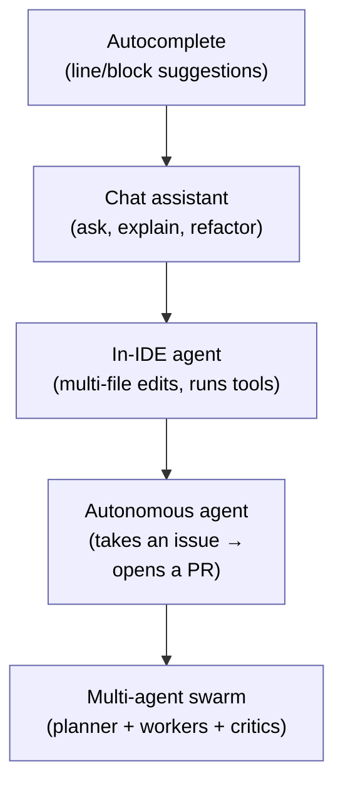
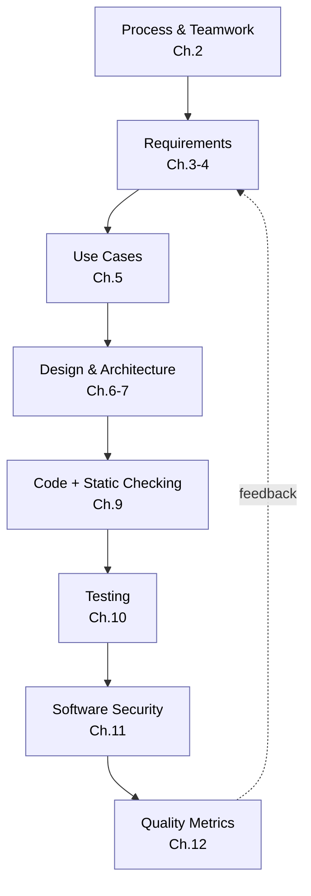
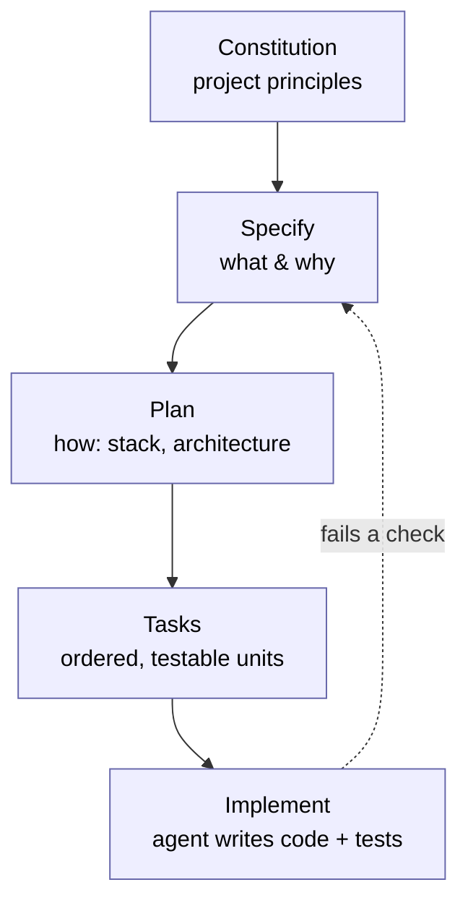
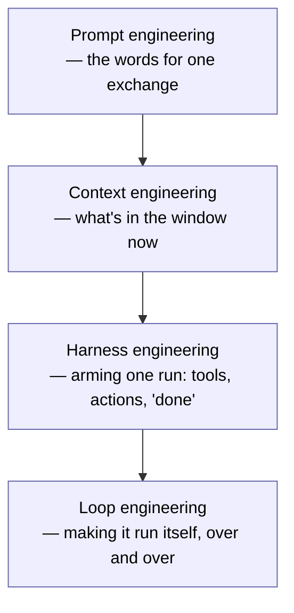
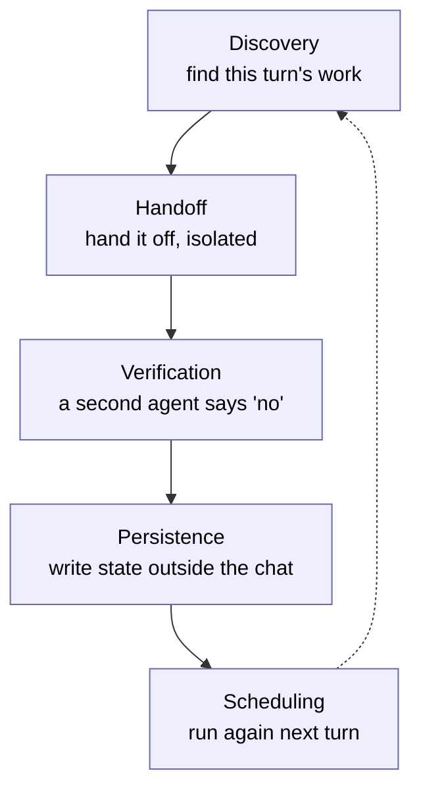
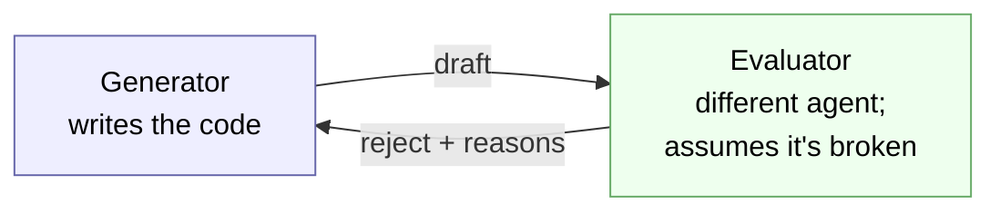

# Chapter 13 — Software Engineering in the Age of AI

> **Where we are.** Every previous chapter described a durable engineering discipline —
> process, requirements, design, checking, testing, metrics, teamwork. This chapter asks
> what happens to those disciplines when generative AI and **coding agents** can draft
> code, tests, requirements, and designs in seconds. We separate what genuinely changes
> from what stubbornly does not, walk the whole lifecycle stage by stage, look honestly at
> the *evidence* (which is more mixed than the marketing), read the **o16g "Outcome
> Engineering" manifesto** as a provocation for the agentic era, and end with the concrete
> practices now emerging to work this way — **spec-driven development**, **agent
> instruction files** (`CLAUDE.md`/`AGENTS.md`), and **loop engineering**.

The headline claim of the moment is that AI writes the code now. The more useful claim is
this: **AI changes where the hard part lives.** For decades the bottleneck was *producing*
correct code fast enough. As producing gets cheap, the bottleneck moves to *deciding what
to build* and *proving it works* — which are the very activities this book has been
teaching. The engineer who internalized Chapters 1–12 is the person best positioned to
*direct* the agents.

## 13.1 What AI Changes — and What It Doesn't

### 13.1.1 Essential vs. Accidental Complexity, Revisited

Recall from Chapter 1 the split between **essential** complexity (inherent in the problem)
and **accidental** complexity (from our tools and toil). Generative AI is a spectacular
weapon against *accidental* complexity: boilerplate, glue code, format conversions, first
drafts of tests, "how do I call this API" friction. It is far weaker against *essential*
complexity: deciding what the system should actually do, resolving conflicting goals,
choosing an architecture whose likely changes are cheap. That boundary is the single most
important idea in this chapter. **Delegate the toil; own the essence.**

### 13.1.2 The Four Pressures Still Hold

The book's four cross-cutting pressures do not go away — AI just shifts them:

- **Software is complex.** Agents can *generate* complexity faster than ever, including
  accidental complexity you did not ask for. Architecture (Chapters 6–7) matters *more*.
- **Requirements change.** AI lowers the cost of *responding* to change, which raises the
  premium on knowing *which* change is worth making (Chapters 3–4).
- **Defects are inevitable.** AI produces plausible-looking defects at scale. Reviews,
  static checking, and tests (Chapters 9–10) become the load-bearing walls.
- **Teams need coordination.** "Teams" now include non-human members. Coordinating a
  *swarm* of agents is a new and unsolved organizational problem (see §13.4).

### 13.1.3 A Ladder of Assistance: From Autocomplete to Agents

"AI coding" is not one thing. It helps to name the rungs, because the engineering
questions differ at each:



As assistance deepens from autocomplete toward a full agent swarm, the human's job moves
from *typing* toward *specifying, supervising, and verifying* — and the cost of a
confident-but-wrong output rises, because more happens between your instruction and your
review.

### 13.1.4 The Productivity Paradox

Does AI make developers faster? The honest answer is *it depends, and the evidence is
mixed enough to demand humility.*

- **Perceived gains are large.** In field studies, a majority of developers report feeling
  more productive with tools like GitHub Copilot, and vendors cite eye-catching
  numbers.[^1][^2]
- **Measured gains are smaller and sometimes negative.** In a 2025 randomized controlled
  trial, METR had experienced open-source developers do real tasks in repositories they
  knew well. Developers *predicted* AI would make them ~24% faster; in fact they were about
  **19% slower** with AI — and still *believed* they'd been faster afterward.[^3] The slowdown
  came largely from the overhead of **reviewing and integrating** generated output. Scope
  the finding as carefully as the researchers did: it describes *that specific setting* —
  experienced developers, mature and familiar repositories, high quality standards,
  early-2025 tools — not AI-assisted work in general, and tools have moved since.

> **Principle.** Perceived productivity is not measured productivity. On familiar,
> high-standards code, the time you save typing can be swamped by the time you spend
> verifying what the agent produced. *Verification is the new bottleneck* — a theme this
> whole chapter returns to.

The lesson is not "AI is useless" — gains are real for boilerplate, unfamiliar APIs,
greenfield prototypes, and well-specified narrow tasks. The lesson is that **leverage
scales with the operator's judgment**, and that you must *measure* impact rather than trust
the feeling of speed (a direct application of Chapter 12).

## 13.2 AI Across the Lifecycle

Here we walk the lifecycle, mapping AI's role onto each chapter's discipline. For each
stage: *what AI does well now*, *where it fails*, and *what fundamental the human still
owns.*



### 13.2.1 Process and Teamwork (Chapter 2)

AI compresses many process activities: drafting sprint plans, summarizing standups,
writing retro notes, triaging issues, generating first-pass estimates. Agents can now take
a ticket and open a pull request unattended, which strains the assumptions of Scrum and XP
— what is a "sprint" when a swarm can attempt fifty backlog items overnight?

- **Fails at:** judgment about *value* and *sequencing*; reading the human dynamics of a
  team; owning accountability for what ships.
- **Human owns:** the definition of done, the choice of what to build next, and
  responsibility. The agile principle "working software is the primary measure of progress"
  gets *sharper*, not softer — see the manifesto's "verified reality" in §13.4.[^4]

### 13.2.2 Requirements (Chapter 3)

Large language models are genuinely useful for **elicitation and drafting**: turning
interview notes, tickets, and support logs into candidate user stories, acceptance
criteria (Given/When/Then), and edge-case lists. Studies report LLM-drafted requirements
that reviewers rate as complete, consistent first drafts — comparable to an entry-level
engineer's — produced far faster and cheaper.[^5][^6]

- **Fails at:** knowing what users actually *need* versus what is *plausible*; an LLM will
  cheerfully invent requirements that sound reasonable and are wrong (**hallucinated
  requirements**), and its fluency can manufacture false consensus.[^7]
- **Human owns:** talking to real stakeholders, resolving conflicting goals (Chapter 3's
  goal hierarchies), and *validating* that a story reflects a real need. Use AI to widen
  the net of candidate requirements; use humans to decide which are true.

### 13.2.3 Estimation and Analysis (Chapter 4)

AI can suggest story-point estimates from historical data and surface comparable past
work. But recall *why* we estimate in Chapter 4: story points model **human uncertainty**
and drive **prioritization**, not stopwatch time. When agents do the building, the
estimation question shifts from "how many engineer-hours?" toward "how much **compute/
budget**, and is the outcome worth it?" — precisely the manifesto's *cost, not time*
reframing (§13.4). MoSCoW, value/cost/risk, and Kano analysis remain the right tools; the
"cost" axis just gets a new currency.

### 13.2.4 Use Cases (Chapter 5)

Given a goal and a happy path, models are good at enumerating **alternative flows** and
exception cases — exactly the tedious part of use-case writing that people skip. That
coverage is valuable. But an agent cannot tell you which actor *goals* matter, and it will
pad use cases with flows no user will ever take.

- **Human owns:** the actor–goal list (what the system is *for*) and pruning generated
  flows down to the ones that carry real risk or value.

### 13.2.5 Design and Architecture (Chapters 6–7)

This is where the human-owned layer is thickest. AI can propose class structures, generate
**Architecture Decision Records (ADRs)**, suggest applicable patterns from Chapter 7, and
even prototype competing designs to compare. Research on multi-agent systems that go from
requirements to candidate architectures is active but early, and leans on role
specialization to fight hallucination.[^8][^9]

- **Fails at:** the *significant, expensive-to-change decisions* that define architecture
  (Chapter 6); it has no stake in your five-year maintenance cost and cannot feel the pain
  of high coupling.
- **Human owns:** modularity, coupling/cohesion trade-offs, and choosing which likely
  changes to make cheap. Let AI *draft and compare* designs; keep the *decision* and its
  rationale human and written down.

### 13.2.6 Static Checking and Code Review (Chapter 9)

AI both helps and harms here, sharply. AI reviewers and smarter static analyzers
catch real bugs, explain them, and suggest fixes.[^10] But **a growing share
of code under review is now itself AI-generated** — by late 2024 Google reported more than
a quarter of its new code was — which inverts the problem from
Chapter 9: the scarce resource, *reviewer trust and attention*, is now spent on machine
output produced faster than humans can vet it.[^11]

> **Pitfall.** A 2023 controlled study found developers with an AI assistant wrote
> *less secure* code while being *more confident* it was secure — a false sense of
> safety.[^12]
> In the AI era, static analysis and human review are the brakes that make the speed
> usable.

- **Human owns:** deciding *intent and trust* (does this change do what we meant?), and
  keeping review standards from eroding under volume. Precision/recall trade-offs for
  analyzers (Chapter 9) matter more as more code flows through them.

### 13.2.7 Testing (Chapter 10)

Testing is where agentic AI has advanced most measurably. Benchmarks like **SWE-bench**
(fix a real GitHub issue) and **SWT-bench** (generate a bug-reproducing test) have driven
rapid progress in automated **test generation** and **program repair**; as of 2025, agents
resolve a substantial fraction of such benchmark issues end to end.[^13][^14] Treat those numbers with
care, though: passing a benchmark's tests is *evidence*, not proof, of a correct fix —
studies of SWE-bench-style evaluation have found patches that pass the benchmark suite
while failing developer-written tests or behaving differently from the true fix, so weak
or incomplete test suites can inflate reported resolution rates (the **oracle problem**
again, wearing a benchmark's clothes).[^15] Models are also strong at
generating unit tests, property-based tests, and boundary cases (Chapter 10's black-box
techniques).[^16]

But the deepest problem in testing survives untouched: the **oracle problem**. A generated
test encodes *what the model thinks correct behavior is* — which may simply mirror a
misunderstanding also baked into the generated code. Coverage numbers can look great while
the tests assert the wrong thing.

Chapter 10's discount example makes the failure concrete: suppose the billing spec says
half-cent prices round *up*, while the generated code trips a language-specific rounding
or representation trap — named in each variant's leading comment — and the generated test
asserts whatever the code already returns.

```generic
function apply_discount(price, percent)
  // AI-generated: rounds the last cent half-to-even (banker's rounding)
  return round_to_2_decimals(price * (1 - percent / 100))

function test_half_off()
  // AI-generated: asserts the code's own behavior
  if apply_discount(10.25, 50) != "5.12" then
    fail "testHalfOff failed"
  end if

test_half_off()                  // passes — and every line of the unit is covered
print apply_discount(10.25, 50)  // 5.12; the billing spec says 5.13 (half up)
```

```go
package main

import "fmt"

func applyDiscount(price, percent float64) string { // AI-generated: %.2f rounds ties
	return fmt.Sprintf("%.2f", price*(1-percent/100)) // to even — banker's rounding
}

func testHalfOff() { // AI-generated: asserts the code's own behavior
	if applyDiscount(10.25, 50) != "5.12" {
		panic("testHalfOff failed")
	}
}

func main() {
	testHalfOff()                         // passes — and every line of the unit is covered
	fmt.Println(applyDiscount(10.25, 50)) // 5.12; the billing spec says 5.13 (half up)
}
```

```java
import java.math.BigDecimal;
import java.math.RoundingMode;

public class OracleProblem {
  static double applyDiscount(double price, double percent) {
    return BigDecimal.valueOf(price * (1 - percent / 100))  // AI-generated: HALF_EVEN
        .setScale(2, RoundingMode.HALF_EVEN).doubleValue(); // = banker's rounding
  }

  static void testHalfOff() {  // AI-generated: asserts the code's own behavior
    if (applyDiscount(10.25, 50) != 5.12) throw new AssertionError();
  }

  public static void main(String[] args) {
    testHalfOff();  // passes — and every line of the unit is covered
    System.out.println(applyDiscount(10.25, 50)); // 5.12; the billing spec says 5.13
  }
}
```

```javascript
const assert = require("node:assert");

function applyDiscount(price, percent) {  // AI-generated: toFixed(2) rounds the stored
  return Number((price * (1 - percent / 100)).toFixed(2)); // double: 8.575 is 8.5749…
}

function testHalfOff() {                  // AI-generated: asserts the code's own behavior
  assert.strictEqual(applyDiscount(17.15, 50), 8.57);
}

testHalfOff();                           // passes — and every line of the unit is covered
console.log(applyDiscount(17.15, 50));   // 8.57; the billing spec says 8.58 (half up)
```

```python
def apply_discount(price, percent):     # AI-generated: Python round() = banker's rounding
  return round(price * (1 - percent / 100), 2)

def test_half_off():                    # AI-generated: asserts the code's own behavior
  assert apply_discount(10.25, 50) == 5.12

test_half_off()                         # passes — and every line of the unit is covered
print(apply_discount(10.25, 50))        # 5.12; the billing spec says 5.13 (half up)
```

```ruby
def apply_discount(price, percent)      # AI-generated: format %.2f rounds ties to
  format("%.2f", price * (1 - percent / 100.0))  # even — banker's rounding
end

def test_half_off                       # AI-generated: asserts the code's own behavior
  raise "test failed" unless apply_discount(10.25, 50) == "5.12"
end

test_half_off                           # passes — and every line of the unit is covered
puts apply_discount(10.25, 50)          # 5.12; the billing spec says 5.13 (half up)
```

```typescript
import assert from "node:assert";

function applyDiscount(price: number, percent: number): number { // AI-generated:
  return Number((price * (1 - percent / 100)).toFixed(2)); // toFixed(2) rounds the double
}

function testHalfOff(): void {            // AI-generated: asserts the code's own behavior
  assert.strictEqual(applyDiscount(17.15, 50), 8.57);
}

testHalfOff();                           // passes — and every line of the unit is covered
console.log(applyDiscount(17.15, 50));   // 8.57; the billing spec says 8.58 (half up)
```

Coverage looked great; the oracle was wrong. The suite agrees with the code because both
encode the same mistake, and only a reviewer who knows the billing spec can see that the
last cent rounded the wrong way — each variant's final print line shows the value the
spec required.

- **Human owns:** the **oracle** — the specification of correct behavior — and the coverage
  *criteria* that decide when testing is enough (statement/branch/MC/DC, §§10.3–10.5).
  Generated tests are a starting point to be reviewed, not ground truth.

### 13.2.8 Security (Chapter 11)

Security is changed on both sides: AI writes vulnerabilities as fluently
as it writes features, and AI-driven tools now hunt for them — autonomous
pentest agents that validate findings with working exploits ([§11.3](../11-software-security/#113-finding-vulnerabilities-from-manual-to-autonomous)).
The human still owns the authorization to test, the judgment that a finding is real, and
the secure-by-design decisions no scanner makes for you.

### 13.2.9 Quality and Metrics (Chapter 12)

AI forces a reckoning with **what we measure**. Lines of code and commit counts were always
weak proxies; when a machine emits thousands of lines on request, they become actively
misleading. One industry analysis reports that as AI assistance spread (2021→2024), the
share of **duplicated/cloned** code rose while **refactoring** fell — a maintainability
warning sign that raw output volume hides, though it awaits independent academic
replication.[^17]

- **Human owns:** choosing metrics that resist gaming (Chapter 12's Goodhart's-Law
  discipline) and that measure **outcomes** — defect-removal efficiency, customer-found
  defects, DORA delivery metrics (Chapter 14), verified value delivered — rather than agent *activity*.
  This is the empirical backbone of Outcome Engineering (§13.4).

### 13.2.10 The Team Project (Appendix A)

In your own project, treat agents as fast, tireless, over-confident junior teammates. Let
them scaffold, draft tests, and explain unfamiliar code — but require the same evidence you
would from a human: a green test suite, a passing review, and a metric that moved. Record
*where* you used AI and *how you verified it*; that provenance is part of honest
engineering (and of your final report).

## 13.3 The Evidence: Productivity, Quality, Security

A balanced reading of the current research:

| Dimension | What the evidence suggests | Caveat |
|-----------|---------------------------|--------|
| **Productivity** | Real gains on boilerplate, unfamiliar APIs, greenfield, narrow well-specified tasks. | On familiar, high-standards code, a 2025 RCT found a ~19% *slowdown*; perception overstates gains.[^3] |
| **Quality** | Faster first drafts; good at tests and explanations. | Rising code duplication and falling refactoring in one industry analysis point to maintainability debt.[^17] |
| **Security** | Analyzers + AI review can catch known bug patterns. | ~40% of AI-generated programs in one study contained vulnerabilities; users felt *more* secure while being *less* so.[^18][^12] |

The through-line: **AI is a power tool, and a power tool amplifies the operator.** In
skilled hands with strong verification (specs, tests, reviews, metrics), it is a real
multiplier. Without those disciplines, it multiplies *output* while quietly degrading
*quality* — and the operator won't feel it happening.

> **Principle.** In the AI era, the fundamentals in this book are not obsolete — they are
> your *verification layer*. Specs say what "correct" means; tests and reviews check it;
> metrics prove it in production. That layer is what turns fast generation into trustworthy
> software.

## 13.4 Outcome Engineering: The o16g Manifesto

In 2026, Cory Ondrejka (co-creator of Second Life; former engineering leader at Google and
Meta; CTO of Onebrief) published the **o16g manifesto** — *Outcome Engineering* — arguing
that agentic development demands a new frame.[^19][^20] Its thesis: **"It was never about the
code."** Code is "the incantation transforming computation into magic," a *mechanism* for
delivering an idea. Once agents remove the constraint of human typing bandwidth, the
manifesto argues, creation is limited by the *cost of compute*, not human capacity — and the
profession should move "beyond software engineering" toward engineering **outcomes**.[^19]

Treat this as an emerging framing, not a settled body of practice: at this writing the
manifesto is months old, its vocabulary is still contested, and no independent evidence
yet shows teams shipping better outcomes by adopting it. Read it the way you would read
the Agile Manifesto in 2001 — a position paper whose worth the next decade will decide.

It is organized around four shifts and **16 principles** in two parts.[^19] Whatever you make of
its rhetoric, its principles map with surprising directness onto the disciplines in this
book — which is itself an argument that the fundamentals endure.

**The four shifts:** *Creation not code. Cost not time. Capacity not backlog. Certainty
not vibes.*[^19]

### Part I — The Goals ("superpowered creation")

1. **The Voyage — Human Intent.** Agents explore paths; humans choose the destination.
   Don't abdicate vision to the machine. *(This book: requirements and goals, Ch. 3.)*
2. **The Truth — Verified Reality is the Only Truth.** Code is a vanity metric; grade agents
   on the verified rate of positive change delivered, not lines written. *(Testing &
   metrics, Ch. 10, 12.)*
3. **The Teamwork — No More Single Player Mode.** Outcome engineering is a team sport;
   define explicit protocols for debate, decision, and delivery. *(Process, Ch. 2.)*
4. **The Liberation — The Backlog is Dead.** Never reject an idea for lack of *time*, only
   lack of *budget*; manage to cost, not capacity. *(Prioritization reframed, Ch. 4.)*
5. **The Joy — Unleash the Builders.** Write code only when it brings joy; delegate
   the toil. *(Essential vs. accidental complexity, Ch. 1.)*
6. **The Map — No Wandering in the Dark.** Never dispatch an agent without context; map the
   territory before building. *(Architecture description, Ch. 6.)*
7. **The Tech Island — Build It All.** When code is the cheapest resource, build to answer
   questions and test hypotheses. *(Prototyping to reduce risk, Ch. 2.)*
8. **The Artifacts — Failures are Artifacts.** Don't just roll back; dissect the failure and
   debug the *decision*, not only the code. *(Retrospectives & post-mortems, Ch. 2, 14.)*

### Part II — The Building ("the iron price")

9. **The Orchestration — Agentic Coordination is a New Org.** Scaling agents mirrors scaling
   people, "faster, weirder, and harder"; design the org chart for the swarm. *(Team
   structure, Ch. 2 / Appendix A.)*
10. **The Law — Code the Constitution.** Encode mission, vision, and rules into the
    environment so agents can parse intent; ambiguity is the enemy of alignment.
    *(Specifications & acceptance criteria, Ch. 3, 5.)*
11. **The Graph — All the Context, Everywhere.** Embed context into the infrastructure (a
    knowledge graph), not just the prompt. *(Architectural views & documentation, Ch. 6.)*
12. **The Order — Priorities Drive Compute.** Compute is still a cost; always know the next
    most important task. *(Value/cost/risk prioritization, Ch. 4.)*
13. **The Documentation — Show Your Work.** Code is the *what*; reasoning is the *why* —
    require agents to record discoveries and rejected paths. *(ADRs & rationale, Ch. 6.)*
14. **The Immune System — Continuous Improvement.** Repeating a mistake is a system failure;
    spend compute on the post-mortem and inoculate against recurrence. *(Process
    improvement & metrics, Ch. 2, 12.)*
15. **The Gate — Risk Stops the Line.** Make risk a *blocking* function; if risk is unknown
    or unmitigated, the line stops. *(Static checking as a quality gate, Ch. 9.)*
16. **The Validation — Audit the Outcomes.** Trust is a vulnerability; models drift, so
    continuously audit agents against the domain. *(Test adequacy & monitoring, Ch. 10–11.)*

### A reading: what's strong, what's open

**What's compelling.** The manifesto's center of gravity — *verified reality over vanity
metrics*, *outcomes over activity*, *encode intent explicitly*, *make risk a blocking
gate*, *audit continuously* — is essentially this book's quality philosophy, restated for a
world where a machine writes the first draft. Principles 2, 10, 14, 15, and 16 are almost a
summary of Chapters 9–12. That convergence is the point: **when generation is cheap,
specification and verification become the whole game.**

**What's open to challenge.** Treat it as a provocation, not gospel:

- *"The backlog is dead / cost not capacity"* assumes compute is cheap and value is easy to
  price. Prioritization under scarcity (Chapter 4) does not vanish; its currency changes.
- *"Certainty, not vibes"* is a high bar. The oracle problem (§13.2.7) means some outcomes
  remain expensive or impossible to verify automatically; "verified reality" has real
  limits.
- The **productivity paradox** (§13.1.4) cautions against assuming agents are a pure
  accelerator; the verification bottleneck can dominate.
- **Deskilling risk:** if engineers stop writing and reviewing code closely, who retains the
  judgment to *audit the outcomes*? The manifesto's own Principle 16 depends on expertise it
  could erode.

Held critically, Outcome Engineering is a useful lens: it names the shift from *producing*
software to *directing and verifying* its production — which is exactly the shift this
chapter has been describing.

## 13.5 Spec-Driven Development

The manifesto argues for encoding intent explicitly ("Code the Constitution") and treating
verified reality as the only truth. **Spec-driven development (SDD)** is the concrete
practice that does exactly that. Its core move is an *inversion*: in ordinary coding the
specification serves the code — a document you write to explain software that already
exists, and that drifts out of date the moment you stop maintaining it. In spec-driven
development the code serves the specification. The spec is the durable artifact; the code
is a *generated, replaceable output* of it.[^21]

That inversion only became practical when a machine could regenerate the code cheaply. When
typing was the bottleneck, rewriting an implementation to match a changed spec was
expensive, so specs decayed. When an agent can regenerate the implementation in minutes,
the spec can be the thing you maintain and the code the thing you regenerate — which is what
Chapter 3 always *wanted* requirements to be.

**The workflow.** Open-source toolkits such as GitHub's **Spec Kit** structure SDD as a
pipeline of phases with a human checkpoint between each, so the agent never runs ahead of a
decision you have not made:[^21]



Each phase has one job, and you do not advance until its artifact is validated:

- **Constitution** — the project's non-negotiable principles (language, testing bar,
  security rules, style). Written once, referenced by every later phase. This is Chapter 3's
  non-functional requirements and Chapter 6's constraints made machine-readable — the same
  idea the manifesto calls "Code the Constitution" (§13.4, P10).
- **Specify** — *what* to build and *why*, deliberately silent on the tech stack. This is
  user-story and acceptance-criteria work (Chapters 3, 5), often written as Given/When/Then
  scenarios so that "done" is executable, not a matter of taste.
- **Plan** — *how*: the architecture, stack, and interfaces the implementation will use
  (Chapters 6–7).
- **Tasks** — the plan decomposed into small, independently testable units, ordered by
  dependency: the vertical slices of Chapter 2.
- **Implement** — the agent writes code and tests against the tasks one slice at a time, so
  its context never fills with the whole system at once.

Between phases sit human approval gates. Their point is not ceremony; it is that a wrong
decision caught in the spec is cheap to fix and the same decision discovered in production
is not — §13.1.3's rising cost of a confident-but-wrong output, front-loaded to the cheapest
place to catch it.

> **Principle.** In spec-driven development the specification is the *source* and the code
> is the *build output*. If the two disagree, the spec wins and you regenerate — which is
> only safe if the spec is precise enough to serve as a contract.

Early adopters report several-fold higher first-pass success from agents on non-trivial
tasks when a real spec precedes the code, versus prompting from a one-line
description.[^21] Treat such figures as encouraging practitioner reports, not controlled
measurements — but the mechanism is sound and familiar to this book: **most agent failures
are underspecification failures**, and SDD front-loads the specification. The bdfinst
*agentic-dev-team* project is a working template of the same shape — a
`/specs → /plan → /build → /pr` loop in which acceptance-test, design, and UX *critic*
agents challenge the plan before any code is written, and red-green-refactor discipline
(Chapter 10) is enforced during the build.[^22]

The catch is the one §13.2.7 already raised about generated tests: a spec written carelessly
encodes a misunderstanding just as fluently as careless code does — and now that
misunderstanding is the source of truth. SDD moves the human's effort to where it belongs,
into writing an unambiguous specification. That does not remove the human from the work; it
puts more weight on the part that was always the hardest.

## 13.6 Context as Infrastructure: `CLAUDE.md`, `AGENTS.md`, and Skills

An agent begins every session knowing nothing about *your* project: your conventions, your
build command, which directories are off-limits, what "done" means on your team. You can
paste that briefing into the prompt every time — and pay to re-explain it forever, to every
agent and every session. Or you can write it down once, in a file the agent reads
automatically at the start of every run. The playbook of loop engineering (§13.7) names the
recurring cost of *not* doing so as **intent debt**: the price of explaining "what this
project is, what the rules are, where the traps are" over and over.[^23]

A small standard has emerged for paying that debt down. An **agent instructions file** —
`CLAUDE.md` for Claude Code, or the tool-neutral **`AGENTS.md`** — is a Markdown briefing
checked into the repository and loaded at the start of every session.[^24][^25] `AGENTS.md`
was formalized as an open specification in 2025 (led by OpenAI with Google, Cursor, and
others) and donated to the Linux Foundation's Agentic AI Foundation in December 2025; by
then more than 60,000 projects had adopted it and more than twenty agent tools could read
it.[^24] It is deliberately just Markdown with no required structure — "a README for
agents."

Think of it as the standing brief you hand a contractor on their first morning: exactly
what they need, in the order they need it, with no ambiguity tolerated. The practices that
make one effective are the practices of good technical writing under a hard constraint — the
file is read *every* session, so every line spends context budget:[^25]

- **High-signal only.** Include what materially changes a decision — the build command, the
  test bar, the directories not to touch — not what the agent can infer by reading the code.
- **Imperative, not aspirational.** "Never use inline mocks; use the factories in
  `test/factories/`" beats "we generally try to avoid mocks."
- **Few load-bearing rules.** If every rule is marked *important*, none is. Keep the list
  short enough that all of it survives a skim.
- **Workflow constraints.** Say when the agent should stop and ask a human — the checkpoint
  the manifesto and §13.7 both insist on.

This is the manifesto's "All the Context, Everywhere" (§13.4, P11) at the scale of one
repository: context embedded in the *infrastructure* rather than retyped into each prompt.
It is also the mechanism behind Principle 10 — the spec-driven *constitution* of §13.5 is
often exactly this file.

**One standard, many dialects.** `AGENTS.md` buys you portability of *facts* — the build
command and the test bar are the same sentence to any agent. It does not buy portability of
*tone*, because each vendor trained and tuned its model differently and each publishes its
own guide for how to phrase what goes inside. When present, most agents still read their own
file — `CLAUDE.md` for Claude Code, `GEMINI.md` for the Gemini CLI, `.cursor/rules/*.mdc` for
Cursor, `.github/copilot-instructions.md` for Copilot — and the way a rule *lands* differs
between them:

| Agent | Instruction file(s) | Where its house guide lives |
|---|---|---|
| **Claude Code** (Anthropic) | `CLAUDE.md`, `.claude/skills/` | Claude Code best practices[^25] |
| **Codex** (OpenAI) | `AGENTS.md` | Codex prompting guide[^28] |
| **Cursor** | `.cursor/rules/*.mdc`, `AGENTS.md` | Cursor *Rules* docs[^29] |
| **Gemini CLI** (Google) | `GEMINI.md` | Gemini CLI docs[^29] |
| **Copilot** (GitHub) | `copilot-instructions.md` | Copilot docs[^29] |
| *portable baseline* | **`AGENTS.md`** | agents.md[^24] |

The clearest example is **capitalization**. Anthropic's Claude Code guide explicitly lists it
as a lever: "you can tune instructions by adding emphasis (e.g., `IMPORTANT` or `YOU MUST`) to
improve adherence."[^25] OpenAI's Codex guide says nothing of the kind; it stresses instead
that instructions be *verifiable* and *decomposed* — give the agent "a specific outcome,
measurable target, or test criteria," and "break [work] into smaller, focused steps."[^28] So
the same shouted rule that sharpens a priority for one agent is, at best, wasted characters
for another: put colloquially, one assistant hears *emphasis* where another just hears
*yelling*. The lesson is not that one guide is right — it is that instruction *phrasing does
not port*, so you read the guide for the tool you actually use and tune tone in that tool's
own file.

One habit does port everywhere: **explain the *why*.** A rule with its rationale — "never log
raw card numbers, it violates PCI scope" — survives translation between tools and lets any
model apply the principle to a case the rule never named, where a bare `NEVER LOG CARD NUMBERS`
does not. That is this book's house style, and it is also the most portable prompt-writing
advice there is.

> **Pitfall.** Instruction phrasing does not port cleanly between agents. A `CLAUDE.md` leaning
> on `IMPORTANT`/`YOU MUST` emphasis can read as noise to a different tool; a terse,
> verification-first `AGENTS.md` can under-specify for a model that leans on stated priorities.
> Keep the portable facts (commands, conventions, definition of done) in `AGENTS.md`; tune tone
> per tool, against that tool's published guide.

**Skills** push the idea one step further. Where an instructions file is standing context
loaded every time, a **skill** is a named, reusable unit of project knowledge — "how we cut
a release," "how we triage failing CI" — that an agent invokes only when the task calls for
it. A skill can be versioned, tested, and improved like any other artifact; a prompt pasted
into a script cannot. That distinction matters for the loops of the next section: a loop
that discovers its own work should trigger a *named skill*, not a wall of instructions
buried in a cron job that no one will ever update.

> **Principle.** Encode project intent once, in a file the agent reads automatically, and
> maintain it like code. Every convention you leave only in your head is a convention the
> agent will violate — confidently, and at scale.

For your team project (Appendix A), an `AGENTS.md` (or `CLAUDE.md`) is a high-leverage first
artifact: capture your stack, your test and lint commands, your definition of done, and your
review rules. It is living documentation that agents obey and humans can read — and writing
it forces the team to make its tacit conventions explicit, which is worth doing even if no
agent ever reads it.

## 13.7 Loop Engineering

The rungs of §13.1.3 ran from autocomplete to autonomous agents. There is a further rung
beyond the ones drawn there, and in 2026 it acquired a name. Within a single week that June, three
practitioners independently described the same shift: Peter Steinberger argued that the
relevant skill was no longer prompting agents but designing the loops that prompt them;
Boris Cherny, who built Claude Code, said from the vendor side that his job was now to write
the loops that drive the agent; and Addy Osmani wrote it up and named it **loop
engineering**.[^23] Its one-line definition is deliberately unsettling: *loop engineering is
replacing yourself* — designing the system that prompts the agent, so that you no longer feed
it one instruction at a time.[^23]

**Four layers.** Loop engineering is the widest layer of a progression the industry
backed into, each layer minding something larger than the one before it:



Prompt engineering minds one exchange; context engineering minds one window (§13.6); harness
engineering arms one run (which tools an agent may call, and what counts as finished); loop
engineering minds the widest scope of all — the system that runs the harness again and
again with no human hand between turns. The first three layers still assume a person at the
keyboard, directing the agent line by line. Loop engineering removes that assumption: the
practitioner moves from *inside* the loop to *outside* it, building the loop rather than
being it.[^23]

This is why the layer belongs in a book about engineering discipline rather than about
tools: **it changes what a mistake costs.** §13.1.3 noted that the cost of a
confident-but-wrong output rises with how much happens between your instruction and your
review. A loop is, by construction, a machine for *maximizing* that distance — it can run all
night, change code you never looked at, and feed its own output back as tomorrow's input.
Every discipline below exists to shorten the gap between a mistake and its discovery.

### 13.7.1 The Anatomy of a Loop

A useful loop does five things each turn, and drops any one of them at its peril:[^23]



- **Discovery** — the loop finds its own work (reads failing CI, open issues, recent commits)
  rather than being handed a task list. Ideally this logic lives in a *skill* (§13.6), not a
  static prompt.
- **Handoff** — each unit of work goes to an agent in an isolated workspace. In git that
  means a separate **worktree** per task, so parallel agents editing the same repository do
  not overwrite one another.
- **Verification** — a *separate* agent, defaulting to skeptical, checks the work. This is
  the load-bearing move; §13.7.2 is about why.
- **Persistence** — results land somewhere that outlives the conversation: a pull request, a
  ticket, a state file on disk. The agent forgets when its context clears; the repository
  does not.
- **Scheduling** — an automation (a timer, a CI trigger, a chat reaction) makes the loop run
  again without anyone remembering to start it. This is what turns a script you run by hand
  into a loop that runs itself.

Miss one move and the loop fails in a characteristic way. The anti-patterns are the shadows
of the skipped moves:[^23]

| Move skipped | How the loop fails |
|---|---|
| **Verification** | *The nodding loop* — the agent grades its own work, approves it, and accumulates plausible mistakes at machine speed. The most common failure. |
| **Persistence** | *The amnesiac loop* — good work is done, then forgotten when context clears; the next run redoes it or collides with it. |
| **Scheduling** | *The manual loop* — five good moves that a human still has to remember to trigger, and eventually won't. |
| **Discovery** | *The blind loop* — the human still hand-feeds work each morning, so the expensive part (deciding *what* to do) was never automated. |
| **Handoff** | *The tangled loop* — parallel agents share one working directory and their edits collide into a mess no one can untangle. |

### 13.7.2 The Generator and the Evaluator

The hardest part of a loop is not getting an agent to *do* the work — it is building
something that can say **"no."** And the agent that wrote the code is the worst possible
judge of it.

Ask an agent to grade what it just produced and it tends to praise it, because the context
in which the code was written is already full of the reasons it was written that way;
looking back, the agent sees its own justification, not the result. Anthropic's engineering
team, building agents that code autonomously for hours, hit this directly: agents overrate
their own output, especially on subjective work.[^26] Their fix — borrowed explicitly from
**generative adversarial networks (GANs)** — was structural, not a matter of wording. You
cannot reliably make an author self-critical, but you can hand the work to a *different*
agent, with different instructions, that carries none of the first one's self-persuasion:[^26]



Two refinements make the evaluator real. First, it should **act, not just read**: an
evaluator that only reads code judges "does this look right," not "does this run right."
Anthropic's evaluator drove the live application through browser automation — clicking,
screenshotting, inspecting the result — and graded behavior against calibrated criteria
rather than reading intent.[^26] Second, its default stance should be **doubt, not trust**:
assume the code is broken until a check proves otherwise. This is the old **maker–checker**
principle from banking — the person entering a large transfer and the person approving it
must differ — applied to the stop condition of a loop.

> **Pitfall.** A loop whose only reviewer is the agent that wrote the code is a loop nodding
> at itself. Coverage numbers, green checkmarks, and confident self-assessment all rise
> together while real quality does not — the §13.2.7 oracle problem, now running unattended.
> The reliable fix is structural: a *separate* evaluator, on a different model where you can,
> that defaults to "no."

This is §13.4's Principle 2 ("Verified Reality is the Only Truth") and §13.3's through-line,
arriving from the practitioners' side: **when generation is nearly free, the scarce resource
is judgment**, and a loop's judgment lives in its evaluator. A strong generator with a weak
evaluator produces confident garbage, faster; a modest generator with a sharp evaluator
produces slow, reliable progress — and only the second compounds safely over many turns.

### 13.7.3 The Costs That Accrue Silently

A loop that runs itself is also a loop that makes mistakes by itself, and the more
cheerfully it runs, the more quietly it errs. Four costs build up with no alarm while the
loop is running, and they reinforce one another:[^23]

- **Verification debt** — merged, unverified output piling up in the gap between "it ran" and
  "it's right," waiting for one morning when it comes due all at once.
- **Comprehension rot** — the codebase grows faster than anyone's understanding of it,
  because reading generated code is duller than writing it and the loop never stops to read.
  A bug in a corner no human has read surfaces only as a production incident.
- **Cognitive surrender** — the attitude version of the first two: not "no time to review"
  but "no longer want to." The more reliable the loop seems, the more tempting it is to stop
  having an opinion about its output.
- **Token blowout** — the only cost that hits the bill directly. An idle bug can spin all
  night, burning budget on rounds that produce nothing, unless a hard cap stops it.

The defenses are cheap, and they are the disciplines this book has taught all along, applied
to a faster machine: **read a representative sample of the loop's output every day** (against
comprehension rot); **set hard budget caps before the loop first runs unattended, not after
the first surprising bill** (against token blowout); and — most important — **keep at least
one human checkpoint where the loop pauses for a person** (against cognitive surrender), not
because a human will always intervene, but because the pause keeps a human *able* to.

> **Case study — Stripe's "Minions."** Stripe's internal coding agents ship on the order of
> 1,300 pull requests a week, kicked off by an emoji reaction in Slack.[^27] What makes that
> reliable is not a stronger model — the harness is a fork of the open-source *Goose* — but
> the *constraints* around it. A deterministic orchestrator assembles context and runs
> hard-coded quality gates (a linter the agent cannot skip, then a commit step) before and
> after the probabilistic model does its part; anything a rule can decide is kept out of the
> model's hands. Every one of those PRs is still reviewed by an engineer — the humans did not
> leave, their time moved from writing to reviewing. Reliability came from the discipline
> around the loop, not the size of the model in it.[^27]

### 13.7.4 Stay the Engineer

The unsettling framing — "loop engineering is replacing yourself" — has a sharp corollary. A
loop is a faithful *multiplier* of whatever its builder brings: give it sound judgment and it
executes good decisions a hundredfold; give it a lapse and it executes the lapse a
hundredfold, faithfully, without ever pausing to ask whether it was right.[^23] The same
loop, built by two engineers, can end in opposite places — one who reads the code and holds a
firm sense of direction uses it to move faster on work they have mastered; one who stops
reading uses it to never have to understand again, and six months later is the gatekeeper of
a machine they can no longer audit.

That is the deskilling risk of §13.4 stated operationally, and it resolves the same way: the
human review point is not a temporary scaffold to remove once the loop is trusted. It is the
permanent feature that *keeps* the loop trustworthy, and the day it is removed is the day
comprehension rot begins in earnest. Build the loop — but build it like someone who intends
to stay the engineer, not just the one who presses go.

> **Principle.** Stop prompting the agent; design the system that prompts it. But design that
> system so a human can always still say "no" — a loop can execute judgment, it cannot supply
> it.

Start small. A first loop should be almost embarrassingly modest: one finding, discovered and
handled end to end, on a timer, with a separate check and a budget cap. Add parallelism
*last*, after the checks have caught real mistakes — the Stripe pipeline is the *end* of that
road, hardened over years, not the place to begin.

## 13.8 Principles for the AI-Augmented Engineer

Synthesizing the evidence and the manifesto into working advice:

1. **Own intent and verification.** Choose the destination and define "correct"; let agents
   explore paths. You are accountable for what ships (Chapter 1's ethics do not delegate).
2. **Keep the fundamentals.** You cannot safely accept what you cannot evaluate. Understand
   the design, the tests, and the metrics well enough to catch a confident wrong answer.
3. **Shift your effort up the stack.** Spend the time AI frees on *specifying* (clear
   requirements, acceptance criteria, ADRs) and *checking* (reviews, coverage, metrics) —
   not on generating more code.
4. **Manage the new risks.** Security defects, license/provenance of generated code,
   hallucination, over-trust, and skill atrophy are now first-class engineering concerns.
5. **Measure outcomes, not activity.** Judge yourself and your agents by verified value
   delivered and defects escaped — never by lines or PR counts.
6. **Automate the loop, not the judgment.** As agents begin to run themselves, encode your
   intent where they read it (§13.6), specify before you generate (§13.5), and keep a
   separate check and a human gate in every loop (§13.7). Speed is only safe behind
   verification you control.

## 13.9 Conclusion

AI does not repeal the four pressures of software engineering; it *relocates* their weight.
Producing code gets cheaper, so **deciding what to build and proving it works** — the
subject of every chapter in this book — becomes the differentiator. The disciplines you
learned are promoted, not made quaint. Requirements are now what you hand the agent to build
from. The specification becomes the constitution it works under. Tests and reviews are the
layer that decides whether the volume of generated code can be trusted, and metrics are the
evidence that a real *outcome* shipped rather than mere output.

The o16g manifesto pushes this to its edge — *it was never about the code* — and whether or
not you accept its every claim, it points where the profession is heading: engineers who
direct fleets of agents toward well-specified, rigorously verified outcomes. The practices
are arriving to match — you write the spec, encode the constitution in a file the agents
read, and design the loop that runs them — but in every one of them the human's job is the
same: own the intent, keep the check, and stay able to say "no." That job is not less
engineering. It is *more* of the hardest, most human parts of it.

---

### Sources

[^1]: GitHub (Eirini Kalliamvakou), *Research: Quantifying GitHub Copilot's Impact on Developer Productivity and Happiness* (2022). [github.blog](https://github.blog/news-insights/research/research-quantifying-github-copilots-impact-on-developer-productivity-and-happiness/).
[^2]: Sida Peng, Eirini Kalliamvakou, Peter Cihon, and Mert Demirer, *The Impact of AI on Developer Productivity: Evidence from GitHub Copilot* (2023). [arXiv 2302.06590](https://arxiv.org/abs/2302.06590).
[^3]: METR (Joel Becker, Nate Rush, Elizabeth Barnes, and David Rein), *Measuring the Impact of Early-2025 AI on Experienced Open-Source Developer Productivity* (2025). [metr.org](https://metr.org/blog/2025-07-10-early-2025-ai-experienced-os-dev-study/) · [arXiv 2507.09089](https://arxiv.org/abs/2507.09089).
[^4]: Kent Beck et al., *Principles behind the Agile Manifesto* (2001). [agilemanifesto.org](https://agilemanifesto.org/principles.html).
[^5]: Madhava Krishna, Bhagesh Gaur, Arsh Verma, and Pankaj Jalote, *Using LLMs in Software Requirements Specifications: An Empirical Evaluation* (2024). [arXiv 2404.17842](https://arxiv.org/abs/2404.17842).
[^6]: Asma Yamani, Malak Baslyman, and Moataz Ahmed, *Leveraging LLMs for User Stories in AI Systems: UStAI Dataset* (2025). [arXiv 2504.00513](https://arxiv.org/abs/2504.00513).
[^7]: Haowei Cheng et al., *Generative AI for Requirements Engineering: A Systematic Literature Review* (2024). [arXiv 2409.06741](https://arxiv.org/abs/2409.06741).
[^8]: Sirui Hong et al., *MetaGPT: Meta Programming for a Multi-Agent Collaborative Framework* (2023). [arXiv 2308.00352](https://arxiv.org/abs/2308.00352).
[^9]: Ruiyin Li et al., *Bridging Requirements and Architecture: Multi-Agent Orchestration with External Knowledge and Hierarchical Memory* (2026). [arXiv 2606.01385](https://arxiv.org/abs/2606.01385).
[^10]: Google Research, *Resolving Code Review Comments with Machine Learning* (2023). [research.google](https://research.google/blog/resolving-code-review-comments-with-ml/).
[^11]: Sundar Pichai, Alphabet Q3 2024 earnings-call remarks — more than a quarter of new code at Google is AI-generated, then reviewed by engineers — as reported by Fortune (2024). [fortune.com](https://fortune.com/2024/10/30/googles-code-ai-sundar-pichai/).
[^12]: Neil Perry, Megha Srivastava, Deepak Kumar, and Dan Boneh, *Do Users Write More Insecure Code with AI Assistants?* (CCS 2023). [arXiv 2211.03622](https://arxiv.org/abs/2211.03622).
[^13]: Carlos E. Jimenez et al., *SWE-bench: Can Language Models Resolve Real-World GitHub Issues?* (2023). [arXiv 2310.06770](https://arxiv.org/abs/2310.06770) · leaderboard at [swebench.com](https://www.swebench.com/).
[^14]: Niels Mündler, Mark Niklas Müller, Jingxuan He, and Martin Vechev, *SWT-Bench: Testing and Validating Real-World Bug-Fixes with Code Agents* (2024). [arXiv 2406.12952](https://arxiv.org/abs/2406.12952).
[^15]: Reem Aleithan et al., *SWE-Bench+: Enhanced Coding Benchmark for LLMs* (2024). [arXiv 2410.06992](https://arxiv.org/abs/2410.06992).
[^16]: Max Schäfer, Sarah Nadi, Aryaz Eghbali, and Frank Tip, *An Empirical Evaluation of Using Large Language Models for Automated Unit Test Generation* (2023). [arXiv 2302.06527](https://arxiv.org/abs/2302.06527).
[^17]: GitClear (William Harding et al.), *AI Copilot Code Quality: 2025 Research* (2025). [gitclear.com](https://www.gitclear.com/ai_assistant_code_quality_2025_research).
[^18]: Hammond Pearce et al., *Asleep at the Keyboard? Assessing the Security of GitHub Copilot's Code Contributions* (2021). [arXiv 2108.09293](https://arxiv.org/abs/2108.09293).
[^19]: Cory Ondrejka, *Outcome Engineering — The o16g Manifesto* (2026). [o16g.com](https://o16g.com/manifesto/).
[^20]: Onebrief, *Onebrief Hires Cory Ondrejka as Chief Technology Officer* (2026). [businesswire.com](https://www.businesswire.com/news/home/20260203520166/en/Onebrief-Hires-Cory-Ondrejka-as-Chief-Technology-Officer-to-Drive-Next-Gen-Command-Operating-System).
[^21]: GitHub, *Spec Kit — a toolkit for spec-driven development* (2025–2026). [github.com/github/spec-kit](https://github.com/github/spec-kit) · intro at [github.blog](https://github.blog/ai-and-ml/generative-ai/spec-driven-development-with-ai-get-started-with-a-new-open-source-toolkit/). Source of the constitution → specify → plan → tasks → implement phases and the "code serves the spec" inversion; first-pass-success figures are early-adopter reports, not controlled studies.
[^22]: bdfinst, *agentic-dev-team* — Claude Code plugins for a spec-to-shipping workflow (2026). [github.com/bdfinst/agentic-dev-team](https://github.com/bdfinst/agentic-dev-team). The `/specs → /plan → /build → /pr` loop with review-critic personas and enforced red-green-refactor gates.
[^23]: Addy Osmani, *Loop Engineering* (2026). [addyo.substack.com](https://addyo.substack.com/p/loop-engineering) · overview at [O'Reilly Radar](https://www.oreilly.com/radar/loop-engineering/). The name and one-line definition, the four-layer stack, the five moves and their anti-patterns, *intent debt*, and the four silent costs (the term surfaced the same week from Peter Steinberger and Boris Cherny, June 2026).
[^24]: *AGENTS.md — an open standard for agent instruction files*. [agents.md](https://agents.md/). Formalized as an open spec in 2025 (OpenAI with Google, Cursor, and others) and donated to the Linux Foundation's Agentic AI Foundation in December 2025; adopted by 60,000+ projects and 20+ tools.
[^25]: Anthropic, *Manage Claude's memory* — Claude Code documentation. [code.claude.com/docs/en/memory](https://code.claude.com/docs/en/memory). `CLAUDE.md` loading and the practices that make an instructions file effective (high-signal, imperative, few load-bearing rules).
[^26]: Anthropic, *Harness design for long-running application development* (2026). [anthropic.com/engineering](https://www.anthropic.com/engineering/harness-design-long-running-apps). The generator–evaluator (and planner) architecture, its GAN inspiration, browser-driven evaluation, and the finding that agents overrate their own output.
[^27]: Steve Kaliski (Stripe), *How Stripe built "minions" — AI coding agents that ship 1,300 PRs weekly from Slack reactions*, *How I AI* podcast (2026). [lennysnewsletter.com](https://www.lennysnewsletter.com/p/how-stripe-built-minionsai-coding) · coverage at [InfoQ](https://www.infoq.com/news/2026/03/stripe-autonomous-coding-agents/). Deterministic gates around a *Goose* fork; reliability from constraints, not model size.
[^28]: OpenAI, *Codex — Prompting* and *Best practices* (2026). [developers.openai.com/codex/prompting](https://developers.openai.com/codex/prompting) · [/codex/learn/best-practices](https://developers.openai.com/codex/learn/best-practices). Stresses verifiable, decomposed instructions with measurable success criteria; unlike Anthropic's guide, it gives no capitalization/emphasis advice. See also Anthropic, *Best practices for Claude Code* — [code.claude.com/docs/en/best-practices](https://code.claude.com/docs/en/best-practices) — for the `IMPORTANT`/`YOU MUST` emphasis lever quoted in [^25].
[^29]: Per-tool instruction conventions: Cursor, *Rules* — [cursor.com/docs/rules](https://cursor.com/docs/rules); Google, *Provide context with `GEMINI.md` files* (Gemini CLI) — [geminicli.com/docs/cli/gemini-md](https://geminicli.com/docs/cli/gemini-md/); GitHub, *Adding repository custom instructions for Copilot* — [docs.github.com](https://docs.github.com/copilot/customizing-copilot/adding-custom-instructions-for-github-copilot).

---

- **Key takeaways** are summarized above in §13.9.
- Continue to the [Exercises](exercises.md).
- Go deeper with the [Open Resources](resources.md) for this chapter.
