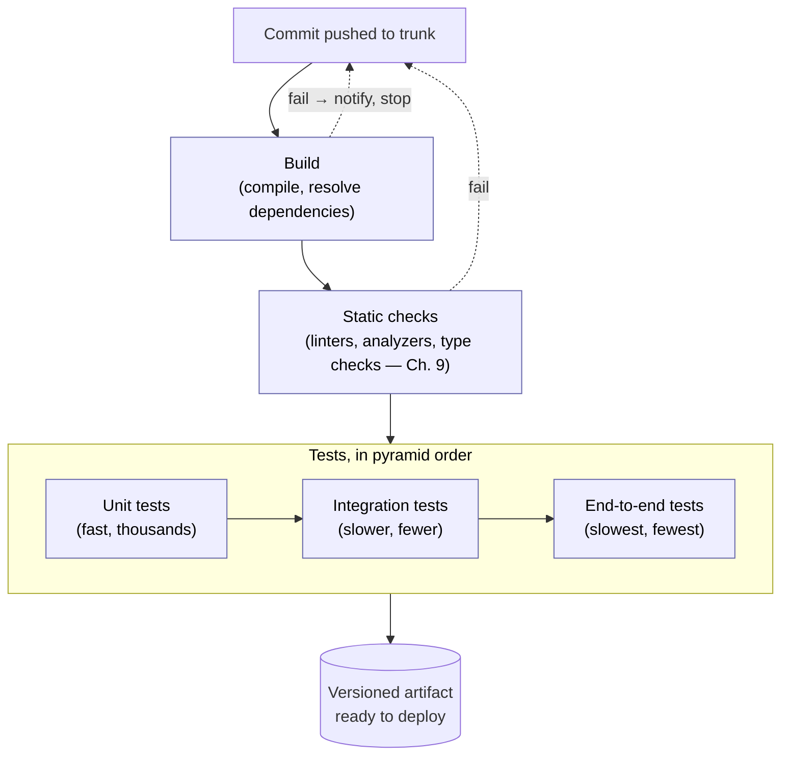
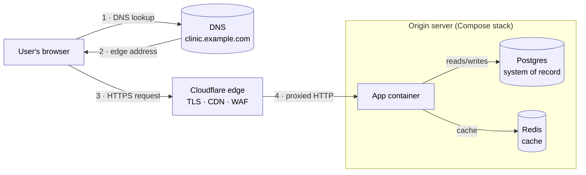

# Chapter 14 — Delivery: CI/CD, DevOps, and Evolution

> **Where we are.** Chapter 13 asked how AI changes the practice of software engineering;
> this final chapter asks a question the earlier
> chapters quietly deferred. Chapters 1–12 taught you how to *build* software — process,
> requirements, design, patterns — and how to *verify* it with reviews, tests, security
> scanning, and metrics.
> But a verified commit sitting in a repository helps no one. This chapter covers the
> stretch of engineering between "the code is written" and "users are running it," and then
> the longer stretch after that: what happens to code once it has been in production for
> years. **Delivery** is where every earlier discipline either becomes real or stays
> theoretical.

Delivery used to be an afterthought — a thing operations people did after engineering was
"done." Two shifts ended that. First, software moved to the cloud, where releasing stopped
being a rare, ceremonial event and became something a team might do dozens of times a day.
Second, a body of research (§14.7) showed that *how* a team delivers predicts its
performance better than almost anything else it does. The umbrella term for the resulting
culture is **DevOps**: the idea that developing software and operating it are one
discipline, practiced by one team, with shared tools and shared accountability. This
chapter walks the pipeline from commit to production, studies two of the most instructive
deployment disasters on the public record, shows concretely how a service is packaged and
put online — containers, a database, a domain, a certificate, and the edge — and closes
with the fate that awaits all successful code: becoming legacy.

> **Principle.** Undeployed code is inventory, not value. Every practice in this chapter
> exists to shrink the time and the risk between *writing* a change and *learning* what it
> does in the hands of real users — the same short-feedback bet Chapter 2 made about
> process, now applied to the machinery of release itself.

## 14.1 SaaS and the Cloud

### 14.1.1 From Shipped Artifact to Running Service

For most of software history, delivering software meant producing an **artifact** — a
binary on tape, a shrink-wrapped CD, an installer download — that customers took away and
ran on *their* machines. The vendor's job ended at the factory gate. Under that model,
releases are naturally rare and heavy: every artifact that leaves the building is
effectively unpatchable for months, so it must be as close to perfect as testing can make
it, and mistakes are answered with recalls, patch disks, and support calls.

**Software as a service (SaaS)** inverts the arrangement: the software runs on machines
the *vendor* controls, and users reach it over the network, usually through a browser or a
thin client. Nothing ships. That single change rearranges almost everything downstream.
There is exactly one version in production, not a museum of old installs to support. The
vendor sees real usage directly — logs, errors, performance — instead of hearing about it
through support tickets. And because the vendor owns the machines, an update is an
internal operation rather than a request to thousands of customers: it can happen at any
time, invisibly, many times a day.

The pull toward SaaS is not only the vendor's. Users get real benefits from the same
arrangement: their data lives on the service, so a stolen laptop or a dead phone loses a
device, not the work; several people can collaborate on the *same* data at once instead of
emailing copies back and forth; and datasets that are large or constantly changing can
live in one central, managed place rather than being squeezed onto whatever machine each
user happens to own. For a whole class of applications — shared documents, shared
calendars, anything with one truth that many people touch — the service model is both
cheaper to operate and a better product.

On the user's side of the wire, the near-universal thin client is the **browser**: a
program every device already has, speaking a front-end stack of **HTML** for the
document's structure, **CSS** for its presentation, and **JavaScript** for behavior that
runs on the client — while the server side can be written in whatever language the team
prefers, because the browser never sees it. Native mobile apps are the sibling front end,
trading the browser's universality for tighter platform integration; either way, the
architecture is the same service behind a thin client.

### 14.1.2 Multi-Tenancy and Horizontal Scaling

Running the software yourself raises a design question: does each customer get their own
copy? In a **multi-tenant** design, one running instance of the system serves many
customers — *tenants* — whose data is kept logically separate inside shared
infrastructure. Multi-tenancy is what makes SaaS economical: one fleet, one deployment,
one upgrade for everyone, with the cost of operations amortized across all tenants. The
price is that isolation becomes a software problem. A bug that leaks one tenant's data to
another, or one tenant's heavy load that starves the rest (the "noisy neighbor"), are
failure modes a shipped artifact simply could not have.

Serving many tenants also means serving unpredictable load, and the cloud's answer is
**horizontal scaling**: instead of buying a bigger machine (*vertical* scaling), you run
more copies of the same service behind a load balancer and add or remove copies as demand
moves. Horizontal scaling only works if any copy can serve any request — which is exactly
why the statelessness convention of RESTful design matters
([§7.5.4](../07-architectural-patterns/#754-restful-apis)). A service that keeps
per-client session state on one server has silently welded each user to that server;
a stateless one lets the platform treat servers as interchangeable, replaceable cattle.
Architecture decisions from Chapter 7 are, it turns out, *delivery* decisions too.

### 14.1.3 What the Cloud Does to the Iron Triangle

Recall the iron triangle of Chapter 1
([§1.5](../01-introduction/#15-balancing-constraints-the-iron-triangle)): scope, schedule,
and cost constrain each other, and the classic pressure point was the *release date* — a
single, high-stakes deadline toward which scope was cut and quality was crunched. SaaS
dissolves that pressure point. When deploying is cheap and continuous, **release stops
being an event and becomes a decision** — a small, revocable, per-feature decision made
many times a week. You no longer ask "what can we finish by the ship date?" but "is this
one change ready to meet users now?" Schedule pressure does not vanish; it decomposes into
many tiny pressures, each too small to justify heroics.

That is the economic root of the **deploy-early culture**. Teams that deploy each small
change as it is finished get feedback while the change is still fresh in their heads, keep
the gap between "works on my machine" and "works in production" permanently small, and
never build up a terrifying pile of unreleased work whose first contact with reality is a
big bang — the same pathology, at the release level, that
[§2.4.1](../02-software-development-processes/#241-the-perils-of-big-bang-integration-and-testing)
diagnosed at the integration level. The rest of this chapter is the machinery that makes
deploying early *safe* rather than merely brave.

### 14.1.4 The Cloud Landscape: Providers, Components, and Responsibility

The vendor-controlled machines of §14.1.1 have to live somewhere, and today they mostly
live in a **public cloud**: vast provider-owned datacenters whose capacity is rented out
over the network, by the hour or by the request. As of 2025, the market is led by Amazon
Web Services (AWS), Google Cloud, and Microsoft Azure, with a long tail of smaller providers —
DigitalOcean, Linode, Hetzner — that trade breadth of catalog for simplicity and price.[^1]
Hold the names loosely: provider names and product lists date quickly, but the concepts
beneath them do not. Every cloud, whatever its branding, sells the same four component
families. **Compute** is processing capacity — virtual machines, containers, or functions
that run your code. **Storage** is durable data — disks, object stores, managed databases.
**Network** is the plumbing — private networks, load balancers, DNS — that lets
those pieces reach each other and the world. And **security and identity** is the control
plane over the other three: who, and which programs, may do what to which resources.

The cloud's economic promise is threefold. You pay only for what you use, turning a large
up-front hardware purchase into a metered utility bill. You can place your system in
regions around the world, near your users, without signing a lease on another continent.
And the hardware is someone else's problem — provisioning, failed disks, power, cooling,
and physical security are all handled below the waterline of the service you rent.

What the provider explicitly does *not* handle is captured by the **shared responsibility
model**: the provider secures the cloud — the facilities, the hardware, the hypervisor —
while you secure what is *in* it — your operating-system configuration, your code, your
data, and who can access all three.[^2] This is a legal line as much as a practical one, and
teams forget it at their peril: a world-readable storage bucket full of customer records
is *your* breach, however secure the datacenter around it was.

None of this makes the cloud automatic. The alternatives — **on-premises** servers you
own, or rented space and machines in a shared datacenter (**co-location**) — never went
away, and the honest question is when each wins. Cloud makes clear sense when you do not
yet know what hardware you need, when demand is spiky or unpredictable (provision for the
spike and pay for it forever, or scale for the hour it lasts), when speed to a first MVP
matters more than unit cost, and when a small team has no one to spare for operations.

> **Case study.** *Cloud repatriation.* The trade cuts the other way, too. In 2022–23,
> 37signals — the company behind Basecamp — publicly moved its products off the cloud and
> onto purchased hardware, documenting seven-figure annual savings for workloads that were
> steady and predictable rather than spiky.[^3] [^4] And Amazon's own Prime Video team published an
> account of cutting the cost of one audio/video monitoring service by roughly 90 percent —
> by moving it *away* from a serverless, distributed-microservices design and back into a
> monolith-style process.[^5] None of this means the cloud is over. The cloud is a
> *cost-and-flexibility trade*, not an axiom. Elastic, uncertain load is where renting
> wins; steady, predictable load is where owning wins. Run the numbers, not the fashion.

### 14.1.5 Containers, Clusters, and Kubernetes

The unit of cloud deployment that has won in practice is the **container**: a package
containing an application plus everything it needs to run — language runtime, libraries,
configuration — isolated from other software on the same machine while *sharing the host
operating system's kernel*. Sharing the kernel is what distinguishes a container from a
**virtual machine**, which carries an entire guest operating system of its own: a
container starts in seconds rather than minutes, and a single host can run dozens of them.[^6]
The container **image** is the immutable, versioned artifact that a CI pipeline (§14.2.2)
builds exactly once and then deploys everywhere — the same byte-for-byte thing on a
laptop, in the test environment, and in production, which retires "works on my machine"
as a category of excuse.

One host is rarely enough, so containers are run on a **cluster**: a set of
network-connected machines managed as a single pool of compute, storage, and memory. And
the de-facto standard software for managing that pool is **Kubernetes** (84% of
organizations in CNCF's 2023 survey were using or evaluating it), often described
as the *operating system for the cloud*: just as an OS schedules processes onto CPU cores,
Kubernetes schedules containers onto the machines of a cluster.[^7] Around that core job it
handles **ingress** (routing incoming traffic to the right containers), scaling the number
of running copies up and down with demand, restarting containers that crash or fail health
checks, and attaching storage to containers that need it — the operational chores of
§14.1.2's horizontal scaling, automated.

One caveat: Kubernetes earns its considerable complexity at fleet scale.
For a small team — certainly for a class project — a single container on one host, or a
platform-as-a-service that runs your container for you, delivers most of the benefit at a
small fraction of the operational cost. Learn what Kubernetes is for; reach for it when
you have the problem it solves.

### 14.1.6 Distributed Trade-Offs: The CAP Theorem

Horizontal scaling (§14.1.2) eventually reaches the data layer, and the moment state is
*replicated* — living on more than one machine — a hard theoretical limit applies. Eric
Brewer's **CAP theorem** concerns three properties of a distributed data system:
**consistency** (every read sees the most recent write), **availability** (every request
receives a response), and **partition tolerance** (the system keeps operating when the
network splits and some machines cannot reach others).[^8] Its real content is narrower than
the popular "pick two of three": in the presence of a partition, a replicated system cannot
guarantee both strong **consistency** and **availability**, so for that data it must choose
which of the two to weaken until the network heals.[^9]

Since partitions are a fact of real networks — switches fail, cables get cut, datacenters
lose connectivity — partition tolerance is not really optional, and the practical content
of the theorem is a forced choice *during* a partition: consistency or availability. A
replica that cannot reach the others can either refuse to answer (staying consistent but
unavailable) or answer from possibly stale data (staying available but inconsistent).
Which to sacrifice is a *requirements* question, not a technical one. A bank chooses
consistency: better to refuse service for a minute than to show two customers different
balances for the same account. A social feed chooses availability: a like count that is a
few seconds stale harms no one, but an unreachable feed is a product failure.

| System | Under partition, it keeps… | What users see |
|---|---|---|
| Bank ledger | Consistency | Brief "service unavailable" — never a wrong balance |
| Social feed | Availability | The feed always loads; counts may lag and converge later |

The theorem is why architecture and delivery keep meeting in this chapter: the shared-data
pattern ([§7.2.1](../07-architectural-patterns/#721-the-shared-data-pattern)) put one
authoritative store at the center of a system, and scaling that store horizontally
(§14.1.2) replicates it — at which point CAP stops being theory and becomes a decision
your team must make on purpose, per feature, with the requirements in hand.

## 14.2 Continuous Integration Pipelines

Chapter 2 introduced **continuous integration (CI)** as an XP engineering practice:
everyone merges into a shared mainline many times a day, and an automated build-and-test
run verifies each merge
([§2.3.4](../02-software-development-processes/#234-a-scrumxp-hybrid)). That definition
told you *what* CI is and *why* it exists — to surface integration mismatches one small
change at a time instead of all at once. This section goes deeper: what the automation
actually consists of, what branching discipline it demands, and what social contract makes
it work.

### 14.2.1 Trunk-Based Development

CI is first a *branching* policy, and only second a server. In **trunk-based
development**, the whole team commits to a single shared mainline (the *trunk*), directly
or through short-lived branches that live hours to a couple of days before merging. The
alternative — **long-lived feature branches**, where each developer or feature camps on
its own branch for weeks — feels safer because nobody's half-done work disturbs anyone
else. But the safety is an illusion with interest due at merge time: the longer two
branches evolve apart, the more their eventual merge resembles the big-bang integration of
[§2.4.1](../02-software-development-processes/#241-the-perils-of-big-bang-integration-and-testing),
with conflicting assumptions surfacing all at once, weeks after they were made.

The deeper point is that *integration risk grows with divergence*, and divergence grows
with time. Trunk-based development keeps divergence permanently small by construction.
Merging several times a day means each merge carries at most a few hours of divergence —
small enough that conflicts are rare, and trivial when they occur. The obvious objection —
"how do I commit work that isn't finished?" — has a standard answer you will meet in
§14.3.3: hide unfinished work behind a **feature flag** so it can be *integrated* without
being *released*. Integration and release become independent decisions, which is one of
the most useful separations in this whole chapter.

### 14.2.2 The Stages of a Pipeline

A **CI pipeline** is the automated gauntlet every commit runs before it is declared good.
The pipeline is where earlier chapters' verification techniques stop being activities a
diligent person might perform and become *gates no change can skip*. A typical pipeline
runs stages in increasing order of cost, failing fast on the cheap ones:



Take the stages in order. The **build** proves the change even compiles and its
dependencies resolve — the cheapest possible check, so it runs first. **Static checks**
run the automated analysis of Chapter 9
([§9.4](../09-static-checking/#94-automated-static-analysis)) — linters, type checkers,
style and bug-pattern analyzers — catching whole classes of defects without executing a
line. Then the **tests by level** from Chapter 10 run in pyramid order: unit tests first
because they are fast and localize failures precisely, then integration, then a thin layer
of end-to-end tests. If everything passes, the pipeline produces a **versioned artifact**
— a container image, a package, a binary — that is stored and never rebuilt. This last
rule matters more than it looks: the artifact you tested is *byte-for-byte* the artifact
you will deploy. Rebuilding "the same code" later invites the possibility that a changed
compiler, dependency, or build machine produces something subtly different from what
passed the tests. Mature pipelines add one more gate on the far side of deployment itself:
a **smoke-test stage** — a fast is-it-alive check (does the service start, answer a
trivial request, reach its database?) run against the newly deployed version, gating the
rollout before real traffic widens onto it (the testing levels these stages draw on are
[Chapter 10](../10-testing/#102-levels-of-testing)'s).

### 14.2.3 Broken-Build Discipline

A pipeline is only as good as the team's response when it turns red. The working culture
of CI rests on a small social contract. First, **a red mainline is everyone's emergency**:
when the trunk build breaks, fixing it (or reverting the breaking commit) takes priority
over new work, because every hour the build stays red, every other developer is either
blocked or building on sand. Second, **never commit onto a broken build** — you would be
stacking unverified change on unverified change, exactly the divergence CI exists to
prevent. Third, **do not leave a broken build overnight**; revert if you cannot fix
quickly. Reverting is not an insult. It is the cheap, always-available path back to a
known-good state, and teams that treat it as routine stay green far more than teams that
treat it as defeat.

The metaphor that captures all of this: *the build is the team's heartbeat*. When it is
green and beating steadily, every developer enjoys a continuous, machine-checked guarantee
that the shared codebase works, and can move fast on top of it. When it is red, the team
has no pulse — nobody actually knows whether the system works — and everything else should
stop until it does.

> **Pitfall.** *The flaky test.* A test that fails intermittently without a code change is
> more corrosive than a test that always fails, because it teaches the team to ignore red.
> Once "just re-run it, that one's flaky" enters the vocabulary, the build has stopped
> being a heartbeat and become a slot machine, and real failures start slipping through on
> the same shrug. Quarantine flaky tests immediately, fix or delete them promptly, and
> treat their existence as a defect in the suite.
> [§10.2.4](../10-testing/#1024-case-study-test-early-and-often--the-testing-pyramid)
> catalogs the usual causes — races, shared state, order dependence, unstable externals —
> and their fixes.

### 14.2.4 Keeping Pipelines Fast

Pipeline speed is a hard constraint, not a convenience. Developers are supposed to merge
several times a day and to *wait for green* before moving on. If the pipeline takes an
hour, they will not wait — they will batch up bigger changes to amortize the wait,
which re-creates the large, risky merges CI exists to eliminate. A useful
target is roughly ten minutes from push to verdict for the merge-blocking stages.[^10]

Achieving that is the testing pyramid of
[§10.2.4](../10-testing/#1024-case-study-test-early-and-often--the-testing-pyramid) applied
as an engineering budget: push checks *down* the pyramid, where they are fast, and keep
the slow end-to-end layer thin. Beyond that, run independent stages in parallel, cache
dependencies and build outputs so unchanged parts are not rebuilt, and split the pipeline
into a fast merge-blocking core plus deeper suites (full end-to-end runs, performance
tests, long fuzzing) that run continuously against the trunk without holding up merges.
Treat a slow pipeline as a process defect that changes how your team behaves, not as a
tooling annoyance to live with.

## 14.3 Continuous Deployment

### 14.3.1 Delivery versus Deployment

Two similar terms name genuinely different commitments. **Continuous delivery** means
every change that passes the pipeline yields an artifact that is *proven deployable* —
the release decision is a business choice, but it is always available, at the push of a
button, with no additional engineering work. **Continuous deployment** goes one step
further: every change that passes the pipeline *is deployed to production automatically*,
with no human in the loop. Delivery makes release *possible* at any moment; deployment
makes it *actual* at every moment.

Continuous deployment sounds reckless until you notice what it forbids. If every green
commit goes to production, then there is no such thing as a "safe to merge but not ready
to ship" change without a flag, no manual pre-release checklist to lean on, and no
batching of changes into a big release whose failures cannot be attributed. Every safety
property must be automated, because automation is all there is. Teams that adopt it report
a paradoxical result that §14.7 will make precise: deploying *more often* makes each
deployment *less* risky, because each one is smaller, better attributed, and easier to
undo.

### 14.3.2 Deployment Strategies

However often you deploy, *how* you swap new code into a live system determines the blast
radius when something is wrong. Two infrastructure-level strategies dominate practice; a
third approach moves the switch into code, and it gets its own section (§14.3.3).

**Blue-green deployment** runs two identical production environments. At any moment one
(say, *blue*) serves all traffic while the other (*green*) sits idle. To release, you
deploy the new version to the idle environment, verify it there against production
conditions, then switch the router so all traffic flows to it. The old environment stays
warm, so if the new version misbehaves, recovery is one router change back. You pay for
this in doubled infrastructure and in the care demanded by anything stateful: a database
schema shared by both environments must remain compatible with both versions during the
switch.

**Canary deployment** releases the new version to a small slice of traffic first — one
server, one percent of users, one region — and watches error rates, latency, and business
metrics before widening. The name comes from the caged canary that warned miners of gas:
the small exposed population absorbs the harm and sounds the alarm while the damage is
still bounded. Large operators generalize canaries into **staged rings**: the change rolls
to ring after ring — internal users, then a small public slice, then broader populations —
with automated health checks gating each promotion and halting the rollout on regression.
The essential idea is *progressive exposure*: no change reaches everyone until it has
demonstrably survived contact with someone.

### 14.3.3 Feature Flags: Decoupling Deploy from Release

Blue-green and canary deployments control exposure with *infrastructure* — routers,
server pools, traffic slices. A **feature flag** (or *feature toggle*) moves the same
control into *code*: a runtime conditional that turns a code path on or off without
redeploying.[^11] Deploying and releasing become fully independent acts. A feature's code
can sit in production for weeks, dark and disabled, while the team keeps merging; when
the moment comes, "releasing" it is a configuration change that takes effect in seconds,
and un-releasing it is the same change in reverse. This is the endpoint of §14.1.3's
argument: release is no longer even a deployment decision — it is a bit you flip.

Flags are also the standard answer to §14.2.1's objection ("how do I commit work that
isn't finished?"): unfinished work merges to trunk dark and disabled, so integration
stays continuous while release waits. In practice flags come in a few kinds with very
different lifespans, and confusing them is where trouble starts:

- **Release flags** hide work in progress until it is ready. They should live *days to
  weeks* — a release flag whose feature has fully rolled out is a deletion you owe.
- **Operational flags** — including the **kill switch** — guard risky paths so an
  operator can disable a misbehaving feature instantly, without a deploy. These are
  deliberately long-lived, few in number, and tested like the safety equipment they are.
- **Experiment flags** split traffic between variants so you can *measure* a change
  (the A/B tests your metrics chapter made honest — §12.5). They live exactly as long
  as the experiment.

Targeting is what makes flags more than an on/off switch: a flag can be on for one user,
one tenant, or three percent of traffic — a **percentage rollout**, which is canary
deployment's progressive-exposure idea (§14.3.2) implemented in code, with no second
environment to pay for.

In the clinic scheduler, both are one conditional — only the predicate changes:

```generic
function scheduler_page(user_id, flags)
  if flags.new_scheduler then          // release flag: one bit, everyone
    return render_new(user_id)
  end if
  return render_old(user_id)
end function

function scheduler_page_rollout(user_id, flags)  // same conditional, new predicate
  // hash user_id to a stable bucket 0..99; each language picks its own hash
  if hash(user_id) mod 100 < flags.new_scheduler_pct then  // stable bucket 0..99
    return render_new(user_id)
  end if
  return render_old(user_id)
end function
```

```go
type Flags struct {
	NewScheduler    bool
	NewSchedulerPct uint32
}

func schedulerPage(userID string, flags Flags) string {
	if flags.NewScheduler { // release flag: one bit, everyone
		return renderNew(userID)
	}
	return renderOld(userID)
}

// same conditional, new predicate: FNV-1a gives a stable bucket 0..99
func schedulerPageRollout(userID string, flags Flags) string {
	h := fnv.New32a()
	h.Write([]byte(userID))
	if h.Sum32()%100 < flags.NewSchedulerPct {
		return renderNew(userID)
	}
	return renderOld(userID)
}
```

```java
class SchedulerFlags {
  record Flags(boolean newScheduler, int newSchedulerPct) {}

  static String schedulerPage(String userId, Flags flags) {
    if (flags.newScheduler()) {                     // release flag: one bit, everyone
      return renderNew(userId);
    }
    return renderOld(userId);
  }

  static String schedulerPageRollout(String userId, Flags flags) { // same conditional
    // String.hashCode() is spec-fixed, so buckets are stable across JVMs — but they
    // differ from the CRC-32 buckets the Python and Ruby variants compute
    if (Math.floorMod(userId.hashCode(), 100) < flags.newSchedulerPct()) { // 0..99
      return renderNew(userId);
    }
    return renderOld(userId);
  }
}
```

```javascript
function bucket(userId) {                            // FNV-1a: stable, JS has no
  let h = 0x811c9dc5;                                // built-in string hash
  for (const ch of userId) h = Math.imul(h ^ ch.codePointAt(0), 0x01000193);
  return (h >>> 0) % 100;
}

function schedulerPage(userId, flags) {
  if (flags.newScheduler) {                          // release flag: one bit, everyone
    return renderNew(userId);
  }
  return renderOld(userId);
}

function schedulerPageRollout(userId, flags) {       // same conditional, new predicate
  if (bucket(userId) < flags.newSchedulerPct) {      // stable bucket 0..99
    return renderNew(userId);
  }
  return renderOld(userId);
}
```

```python
from zlib import crc32

def scheduler_page(user_id, flags):
  if flags["new_scheduler"]:                        # release flag: one bit, everyone
    return render_new(user_id)
  return render_old(user_id)

def scheduler_page_rollout(user_id, flags):           # same conditional, new predicate
  if crc32(user_id.encode()) % 100 < flags["new_scheduler_pct"]:  # stable bucket 0..99
    return render_new(user_id)
  return render_old(user_id)
```

```ruby
require "zlib" # CRC-32: stable, and the same buckets as the Python version
# in production, an open-source flag library like Flipper would manage flag state

def scheduler_page(user_id, flags)
  if flags["new_scheduler"]                          # release flag: one bit, everyone
    return render_new(user_id)
  end
  render_old(user_id)
end

def scheduler_page_rollout(user_id, flags)           # same conditional, new predicate
  if Zlib.crc32(user_id) % 100 < flags["new_scheduler_pct"] # stable bucket 0..99
    return render_new(user_id)
  end
  render_old(user_id)
end
```

```typescript
interface Flags {
  newScheduler: boolean;
  newSchedulerPct: number;
}

function bucket(userId: string): number {            // FNV-1a: stable, JS has no
  let h = 0x811c9dc5;                                // built-in string hash
  for (const ch of userId) h = Math.imul(h ^ ch.codePointAt(0)!, 0x01000193);
  return (h >>> 0) % 100;
}

function schedulerPage(userId: string, flags: Flags): string {
  if (flags.newScheduler) {                          // release flag: one bit, everyone
    return renderNew(userId);
  }
  return renderOld(userId);
}

function schedulerPageRollout(userId: string, flags: Flags): string { // same conditional
  if (bucket(userId) < flags.newSchedulerPct) {      // stable bucket 0..99
    return renderNew(userId);
  }
  return renderOld(userId);
}
```

How does a flip actually reach production? In real systems the flag's *state* lives
outside the code, in a flag-management service — LaunchDarkly and Unleash are common
platforms, and open-source flag libraries exist for every major language — while the
application's SDK keeps a local, in-memory copy of every flag rule. Evaluation happens locally in
microseconds, so the hot path never waits on a network call; changes stream to the SDKs
within seconds of someone flipping the toggle.[^12] And the failure mode is designed in
advance: if the flag service becomes unreachable, SDKs keep serving the last
configuration they saw — the flag system must never be the outage.[^13]

The practice is older than the tooling. Flickr described running trunk-only development
with flags and multiple deploys a day back in 2009, in the post that popularized the
term *feature flipper*.[^14] Facebook's quasi-continuous release keeps many changes
"behind our Gatekeeper system," rolling out code and features independently — "if we do
find a problem, we can simply switch the gatekeeper off rather than revert back to a
previous version or fix forward."[^15] That sentence is the next section's economics in
miniature: the cheapest rollback is the one that is a config flip. And flag management
has graduated from house hack to shared infrastructure — **OpenFeature**, a
vendor-neutral flag API, is now a CNCF incubating project.[^16]

None of this is free. Every long-lived flag doubles the configuration space your tests
must consider — Chapter 10's combinatorial lesson (§10.6) applies directly, so test both
states of any flag that will live past a sprint, and at least pairwise across flags that
interact. And flags demand hygiene *because* they are so easy to add: every
flag needs an owner, an intended lifespan, and a removal date, and a retired flag's code
— both the dead branch and the conditional — must be deleted promptly. Stale flags are
technical debt (§14.8) of an unusually dangerous kind: dormant behavior sitting in
production, waiting for someone to trip it. The first case study below turned that danger
from hypothetical to historical.

> **Pitfall.** Never repurpose an existing flag to control new behavior. The old name
> still points at whatever code the flag used to trigger, and that code is often dormant
> rather than deleted — Knight Capital's repurposed Power Peg flag (§14.3.5) is the
> canonical demonstration of what happens when it runs again. Retire the old flag, delete
> its dead code, and mint a new one; flag names are cheap, and the alternative was not.

### 14.3.4 Rollback versus Roll-Forward

When a deployment goes wrong, you have two exits. **Rollback** returns production to the
previous version; **roll-forward** ships a new fix on top of the broken state. Rollback is
usually faster and requires no new (unverified) code, so mature teams treat it as the
default reflex. But a rollback path is a *mechanism*, and Chapter 10's lesson applies to
mechanisms too: an untested rollback is a rumor, not a capability. Version skew can make
the old code unable to read data the new code wrote; a config change may have accompanied
the code; the "previous artifact" may no longer exist. Teams that take this seriously
rehearse rollback routinely — some by making it the *normal* end of every canary that
fails a health check, so the path is exercised weekly rather than discovered during a
crisis. And some changes cannot be rolled back at all (an irreversible data migration, a
security fix you must not un-ship), which is why roll-forward speed — how fast your
pipeline can carry a one-line fix to production — is itself a safety property.

### 14.3.5 When Deployment Goes Wrong: Two Case Studies

The two case studies below are, respectively, the strongest argument on record *for*
deployment automation and the strongest argument that automation *alone* is not safety.
They are worth studying closely, and honestly, from the primary sources.

> **Case study.** *Knight Capital, August 1, 2012.* Knight Capital was one of the largest
> equity market makers in the United States. When the New York Stock Exchange launched its
> Retail Liquidity Program, Knight updated SMARS — its automated order router — to
> participate. What follows is drawn from the findings in the SEC's later enforcement
> order (Release No. 34-70694, October 2013).[^17]
>
> The new code reused a **feature flag** that had previously activated "Power Peg,"
> defunct order-routing functionality unused since 2003, whose dead code had been left in
> SMARS. Worse, the safety counter that once told Power Peg to stop when orders were
> filled had been inadvertently disabled in 2005, when the counter was moved elsewhere in
> the code and Power Peg was never retested. In the week before launch, a technician manually
> copied the new code onto SMARS's eight production servers — and missed one. No second
> person reviewed the deployment; there was no automated, repeatable deployment process
> to make the eight servers provably identical.
>
> On the morning of August 1, orders routed to the un-updated eighth server hit the
> repurposed flag and woke the old Power Peg code, which began generating child orders
> continuously, never tracking fills, never stopping. Ninety-seven automated email messages
> referencing the Power Peg error had gone out *before the market opened*; no one acted on
> them — they were not designed as alerts, and they went to a group of personnel rather
> than to an owner with a duty to respond. In the
> roughly forty-five minutes that followed, Knight executed about four million trades
> across 154 stocks — on the order of 397 million shares — and, during diagnosis,
> engineers made the situation worse: suspecting the new code, they *rolled it back* on
> the seven correct servers, which put the repurposed flag's old behavior in force on all
> eight. There was no procedure for halting the system's aberrant activity and no
> documented incident-response plan. The loss exceeded $460 million. Knight survived only
> through an emergency investment[^18] and was merged away within a year; the SEC fined it
> $12 million for violating market-access risk-control and related rules.
>
> A note on honesty: the SEC order is an enforcement action about risk controls, and the
> deployment details above are findings within it — the record shows a chain of process
> failures, not the folklore version in which "one line of config" destroyed a company.
> The lessons are about the chain. Deployment must be automated, repeatable, and
> *verified* — an all-servers-identical check would have caught the eighth server in
> seconds. Never repurpose an old flag; delete dead code rather than leaving it armed.
> Alerts without owners are noise. Rollback is only a safety mechanism if it has been
> tested as one — here it was the step that completed the disaster. And a kill switch is required,
> not optional.

> **Case study.** *CrowdStrike, July 19, 2024.* CrowdStrike's Falcon sensor is endpoint
> security software that runs inside the Windows kernel — the most privileged, least
> forgiving place code can live. To respond to new threats quickly, CrowdStrike ships
> "Rapid Response Content": threat-detection configuration delivered to all customers
> through a fully automated global push. The account below follows CrowdStrike's own
> external root-cause analysis, published in August 2024.[^19]
>
> In February 2024, sensor version 7.11 added a new content type defined with twenty-one
> input fields. The code that supplied those inputs provided twenty.
> The mismatch stayed latent for months because both the tests and all earlier content of
> that type used a wildcard match for the twenty-first field, so the missing input was
> never read. On July 19, a new content instance — Channel File 291 — used a non-wildcard
> twenty-first field for the first time. Reading the field that was not there caused an
> out-of-bounds memory read inside the kernel, crashing Windows. Because the sensor loads
> at boot, the machine crashed again on restart: a boot loop. The automated Content
> Validator that should have rejected the bad content had a bug of its own and passed it.
>
> The push was global and simultaneous. Within hours, roughly 8.5 million Windows
> machines (Microsoft's estimate) were down: airlines (Delta alone canceled on the order
> of 7,000 flights), hospitals, banks, broadcasters, emergency services.[^20] [^21] Damage
> estimates ran into the billions — direct losses for the Fortune 500 alone were estimated
> at $5.4 billion, only a fraction of it insured.[^22] Recovery was brutal precisely
> because the machines could not boot: in many cases a human had to start each machine in
> safe mode and delete the file by hand.[^23]
> CrowdStrike's committed remediations read like this chapter's outline: staged canary
> rings for content, customer control over update cadence, a hardened validator, bounds
> checking in the interpreter, and more diverse testing.
>
> The lessons generalize far beyond security software. **Config and content are code**:
> anything that changes the behavior of a running system deserves the same testing,
> staging, and progressive rollout as a code change, no matter how routine its format. A
> fully automated pipeline without progressive exposure is not safety — it is a machine
> for shipping a defect to every user on Earth at once. Validators are code too, with
> false negatives of their own ([§9.4.2](../09-static-checking/#942-false-positives-and-false-negatives));
> a gate you never test is a gate you cannot trust. Design for a bounded blast radius
> *before* you need one. And recovery paths must be designed for the worst case — a fix
> pushed over the network is useless to a machine that cannot boot to receive it.

Read as a pair, the two cases bracket this chapter's argument. Knight shows what manual
deployment costs: without automation, you cannot even guarantee that eight servers run
the same code. CrowdStrike shows what automation without staging costs: with a perfect
distribution machine and no progressive rollout, one latent defect reached the whole
world before anyone could react. Twelve years apart, the timelines rhyme — about
forty-five minutes for Knight's loss, about eighty minutes from CrowdStrike's push to its
reversion.[^24] Automation sets the *speed* of your outcomes; only progressive exposure and tested
recovery decide their *sign*.

## 14.4 Packaging and Running a Service: Docker and Compose

Section 14.1.5 named the container as the unit of cloud deployment, and §14.3 covered
*when* and *how often* to release. This section closes the gap between them: the concrete
mechanics of turning a program that runs on your laptop into a service that runs on a
server. You will build a container image, run an application together with the database and
cache it depends on, and keep the whole stack reproducible. The tools are Docker and Docker
Compose; the ideas they embody — immutable images, declared dependencies, externalized
configuration, persistent volumes — outlast any particular tool.

### 14.4.1 From Dockerfile to Image

A container **image** (§14.1.5) is built from a **Dockerfile**: a text file of ordered
instructions describing, step by step, how to assemble the environment your application
needs.[^25] Each instruction adds a **layer**, a cached filesystem diff, so a rebuild that
changes only your source reuses the earlier layers that installed the runtime and
dependencies and finishes in seconds. Here is a Dockerfile for a small Python web service:

```dockerfile
# Start from a minimal, versioned base image. Pin the tag; never use "latest".
FROM python:3.12-slim

# Do the work inside a dedicated directory in the image.
WORKDIR /app

# Copy dependency manifests first, so "pip install" is cached until they change.
COPY requirements.txt .
RUN pip install --no-cache-dir -r requirements.txt

# Copy the application source last, because it changes most often.
COPY . .

# Document the listening port and the command that starts the app.
EXPOSE 8000
CMD ["gunicorn", "--bind", "0.0.0.0:8000", "app:app"]
```

Two ordering choices there are deliberate. Copying `requirements.txt` and installing
dependencies *before* copying the source means editing a source file does not invalidate
the dependency layer, so most rebuilds skip it entirely. Pinning the base image to
`python:3.12-slim` rather than `python:latest` makes the build reproducible, because
"latest" is a moving target that can change the runtime under you between two builds. You
build the image once and run it as many times as you like:

```bash
docker build -t clinic-app:1.4.0 .        # build, tag with a version
docker run -p 8000:8000 clinic-app:1.4.0  # run, mapping host port to container port
```

> **Principle.** Build once, run anywhere. The image your CI pipeline (§14.2) builds is the
> exact artifact that runs in test and in production, byte for byte. A bug seen in
> production can be reproduced on your laptop by running the same tagged image, and that
> reproducibility is what makes the container's overhead worth paying.

A **`.dockerignore`** file keeps the build small and secrets out of the image: list `.git`,
`node_modules`, `.env`, and local build output so they are never copied into a layer. For a
compiled language, a **multi-stage build** compiles in a fat builder image and copies only
the finished binary into a tiny runtime image, so the shipped image carries no compiler and
no source.

### 14.4.2 Composing a Stack with Docker Compose

A real service is rarely one container. A typical web application is at least three: the
app itself, a database that holds its state, and often a cache. Starting these by hand,
creating a network and passing connection strings between them, is tedious and easy to get
wrong. **Docker Compose** replaces that with one declarative file that describes the whole
stack and brings it up with a single command.[^26]

```yaml
# docker-compose.yml — an app, a database, and a cache as one stack.
services:
  app:
    build: .                      # build from the Dockerfile in this directory
    ports:
      - "8000:8000"               # publish the app to the host
    environment:
      DATABASE_URL: postgres://clinic:${DB_PASSWORD}@db:5432/clinic
      REDIS_URL: redis://cache:6379
    depends_on:
      db: { condition: service_healthy }
      cache: { condition: service_started }

  db:
    image: postgres:16
    environment:
      POSTGRES_USER: clinic
      POSTGRES_PASSWORD: ${DB_PASSWORD}
      POSTGRES_DB: clinic
    volumes:
      - db-data:/var/lib/postgresql/data   # persist data across restarts
    healthcheck:
      test: ["CMD-SHELL", "pg_isready -U clinic"]
      interval: 5s
      retries: 5

  cache:
    image: redis:7

volumes:
  db-data:                        # a named volume, managed by Docker
```

`docker compose up` reads this file, creates a private network so the containers can reach
one another by name, and starts them. Look at the connection strings: the app reaches the
database at the host `db` and the cache at `cache`. Compose resolves those service names to
the right containers on the shared network, so the app never needs to know their IP
addresses. The `depends_on` health condition makes the app wait until Postgres is actually
ready to accept connections, not merely started, which removes a whole class of
start-order race conditions.

### 14.4.3 Stateful Services: Postgres and Redis

Two of those services deserve a closer look, because they hold **state**, and state is
where deployment gets hard. A container is **ephemeral**: stop it and everything written
inside its writable layer is gone. That is exactly what you want for the stateless app
container, which you replace wholesale on every deploy, and exactly what you must prevent
for a database. The fix is a **volume**: storage that lives outside any container's
lifecycle and is mounted into one. In the file above, `db-data:/var/lib/postgresql/data`
mounts a Docker-managed volume at the directory where Postgres keeps its files, so the data
survives `docker compose down` and the next deploy.

The two data services play different roles, and the difference is a direct instance of the
CAP trade-off (§14.1.6) and the shared-data pattern (§7.2.1):

- **PostgreSQL** is the **system of record**: a relational database offering transactions,
  constraints, and durability. When correctness matters — a patient record, a payment, an
  appointment — the data goes here, and Postgres guarantees a committed write is not lost.
  It is the authoritative store §7.2.1 told you to design around.
- **Redis** is an **in-memory cache and data-structure store**: it keeps data in RAM, so
  reads and writes are very fast, and it holds work that tolerates loss — session tokens,
  rate-limit counters, computed results you can recompute, a queue of background jobs.
  Putting a cache in front of Postgres is the usual way to make a read-heavy service fast,
  and it is safe precisely because the cache is disposable: if Redis loses its data, the
  system reads from Postgres and refills it.

> **Pitfall.** Treating the cache as a source of truth. The moment your system *cannot*
> rebuild Redis's contents from the database, you have quietly made an in-memory store your
> system of record, and Redis by default has promised you no such durability. Keep the
> authoritative copy in the durable store and let the cache stay something you can throw
> away and rebuild at any time.

Both Postgres and Redis ship as **official images** on the public registry, maintained and
security-patched by the wider community, which is why the Compose file pulls `postgres:16`
and `redis:7` instead of installing and configuring database servers by hand.[^27] Pin the
major version, as with any dependency (§14.6.2), so an unattended pull cannot upgrade your
database engine underneath you.

### 14.4.4 Configuration and Secrets

Notice what the Compose file did *not* contain: no password written into the image, no
connection string hard-coded in the source. They arrive as **environment variables**
(`${DB_PASSWORD}`), read from an untracked `.env` file or injected by the deployment
platform. This is the externalized-configuration rule of the twelve-factor model: one image
runs in every environment, and what differs between environments — credentials, hostnames,
feature toggles — lives in configuration outside the image.[^28]

The rule earns its keep twice. It keeps a single image promotable from test to production
without a rebuild, and it keeps secrets out of the image and out of version control, where
§14.6.3 shows they cause real breaches once leaked. A committed `.env` file is one of the
most common ways a live credential ends up in a public repository.

> **Principle.** One image, many environments. If moving a build from staging to production
> requires rebuilding it, the build was never really the artifact; its configuration was.
> Externalize what changes between environments so the thing you tested is exactly the thing
> you ship.

## 14.5 Reaching Users: DNS, TLS, and the Edge

You now have a stack running on a server. That server has an IP address like
`203.0.113.10`, but no user will type that, and no browser will trust it without a padlock.
Two pieces of internet infrastructure bridge the distance between "a container is running
somewhere" and "anyone can reach it safely at `https://clinic.example.com`": the **Domain
Name System**, which turns a name into an address, and **TLS**, which encrypts and
authenticates the connection. This section explains both, adds the layer most real
deployments put in front of everything else, and closes with a complete deployment from
start to finish.

### 14.5.1 How a Name Becomes an Address

The **Domain Name System (DNS)** is the internet's directory: a globally distributed
database that maps human-readable names like `clinic.example.com` to the numeric IP
addresses machines actually route to.[^29] Every web request begins with a DNS lookup, and
understanding the pieces clears up what is otherwise the most common source of "it works
locally but not in production."

You obtain a domain from a **registrar**, the company you buy `example.com` from. The
registrar records which **nameservers** are authoritative for your domain — the servers
that hold the real answers. When someone visits your site, their computer asks a
**resolver** (usually run by their ISP, or a public one like `1.1.1.1`), which walks the
hierarchy: it asks a **root** server who handles `.com`, asks that **TLD** server who is
authoritative for `example.com`, and finally asks your authoritative nameserver for the
specific record. Each answer is cached along the way for a period set by the record's
**TTL** (time to live), which is why a DNS change is not instant: older cached answers
linger until their TTL expires. The authoritative nameserver holds **records**, each a
typed mapping. The handful you actually set for a deployment:

| Record | Maps a name to | Example use |
|--------|----------------|-------------|
| **A** | an IPv4 address | `clinic.example.com` → `203.0.113.10` |
| **AAAA** | an IPv6 address | `clinic.example.com` → `2001:db8::10` |
| **CNAME** | another name (an alias) | `www.example.com` → `clinic.example.com` |
| **MX** | a mail server | routes email addressed to the domain |
| **TXT** | arbitrary text | domain verification, email (SPF/DKIM) policy |

To point a domain at your running server, you create an **A record** from your name to the
server's IP address. That is the whole mechanism: a name, a type, a value, and a TTL.

> **Pitfall.** Blaming the code for a DNS TTL. You repoint an A record to a new server, test
> from your own machine, and it works — yet users keep hitting the old server for minutes or
> hours, because their resolvers cached the previous answer for its TTL. Before a planned
> migration, lower the record's TTL well in advance so the cutover is quick, then raise it
> again afterward to cut lookup load.

### 14.5.2 HTTPS and TLS Certificates

A DNS lookup gets a browser to your server; **TLS** (Transport Layer Security, the protocol
behind the `s` in `https`) makes the connection between them private and trustworthy. It
does two things at once: it **encrypts** the traffic so no one on the network path can read
or alter it, and it **authenticates** the server so the browser knows it is really talking
to `clinic.example.com` and not an impostor. Modern browsers now treat plain HTTP as a
defect, labeling it "Not Secure," and the large majority of page loads happen over
HTTPS.[^30] For a real deployment, TLS is not a nicety to add later.

Authentication rests on a **certificate**: a file, issued by a **Certificate Authority
(CA)**, that binds your domain name to a cryptographic key and carries the signature of an
authority the browser already trusts. When a browser connects, the server presents its
certificate; the browser checks the CA's signature and that the name matches, then
negotiates an encrypted session. A certificate for a name you do not control cannot be
obtained from a trusted CA, which is what stops an attacker from impersonating your site.

Certificates were once a paid, manual chore. **Let's Encrypt** changed that: a nonprofit CA
that issues certificates for free and fully automatically over the **ACME** protocol, which
lets a program prove it controls a domain and receive a certificate with no human in the
loop.[^31] Let's Encrypt now secures over 700 million sites and issues on the order of ten
million certificates a day.[^32] Its certificates are deliberately **short-lived** and
**auto-renewed**: a program renews them well before they expire, so a forgotten manual
renewal can no longer take a site down. In practice you rarely touch a certificate directly
— a **reverse proxy** such as nginx or Caddy sits in front of your app container, obtains
and renews the certificate, terminates TLS, and forwards plain HTTP to the app over the
private network.

### 14.5.3 The Edge: CDNs and Cloudflare

That reverse-proxy idea generalizes into one of the most important pieces of modern
deployment: a layer at the **edge**, between your users and your server, that handles
concerns you would rather not build yourself. The dominant provider is **Cloudflare**, and
the mechanism is a small DNS change. Instead of pointing your domain straight at your
server, you point it at Cloudflare, which **proxies** each request to your origin server
behind the scenes.[^33] Your server's real address is hidden, and every request flows
through Cloudflare first. Sitting in that position lets the edge do several jobs:

- **Content delivery (CDN).** Cloudflare runs servers in hundreds of cities and caches your
  static content close to users, so a visitor in Sydney is served from Sydney rather than
  waiting on a round trip to your origin. This cuts latency and offloads your server.
- **TLS termination.** The edge presents the HTTPS certificate and encrypts the user
  connection, so you get valid TLS without configuring it on the origin at all.
- **Security.** Because all traffic passes through it, the edge can absorb **distributed
  denial-of-service (DDoS)** attacks — floods of traffic meant to exhaust your server — and
  filter malicious requests with a **web application firewall (WAF)** before they reach you.

The scale is what makes this remarkable. Cloudflare sits in front of roughly **one in five
of all websites** and carries well over 20% of global web request traffic, so a large share
of the internet is proxied through this one network.[^34] That scale is the source of both
its value, because it sees enough traffic to recognize new attacks quickly, and a real
concern: when a service this central has an outage, a visible slice of the web goes down
with it. The concentration is worth weighing when you decide how much of your delivery to
place behind a single provider.

> **Pitfall.** Assuming the edge makes your origin safe to ignore. Cloudflare hides and
> protects your origin only if the origin is not *also* reachable at its real IP address. If
> an attacker finds the origin IP and your server still accepts direct connections, they
> bypass the edge entirely. Configure the origin to accept traffic only from the edge, so
> the protection cannot be stepped around.

### 14.5.4 A Full Deployment, End to End

The pieces now assemble into one picture. Here is the whole path a request travels, and the
sequence a team follows to put a first real service online:



Walking the deployment in order:

1. **Build the image.** Your CI pipeline (§14.2) builds the container image from the
   Dockerfile, tags it with the commit's version, and pushes it to an image registry.
2. **Run the stack.** On a host — a rented virtual machine, or a platform-as-a-service that
   runs containers for you — you bring up the Compose stack: the app image plus
   `postgres:16` and `redis:7`, with a volume for the database and configuration supplied
   through environment variables.
3. **Point the domain.** In DNS you create a record for `clinic.example.com`. Behind
   Cloudflare, it points at Cloudflare and Cloudflare proxies to your origin; otherwise it
   is an A record straight to the origin's IP.
4. **Get a certificate.** A reverse proxy on the origin obtains a Let's Encrypt certificate
   over ACME, or Cloudflare terminates TLS at the edge, so the site serves valid HTTPS.
5. **Release safely.** You roll the new version out with a strategy from §14.3 — behind a
   feature flag, or as a canary to a slice of traffic — and watch the DORA signals of §14.7:
   when deployment frequency is high and change-fail rate stays low, the machinery is sound.

None of these steps is exotic, and a small team can stand up this entire stack in an
afternoon. The chapter's argument is that doing it *repeatably* — an image built once by a
pipeline, configuration externalized, the database on a durable volume, the release
automated and progressively exposed, the whole path observed — is what separates a demo that
happens to be online from a service a team can operate, and keep operating, as it changes.

> **Principle.** A deployment is a system, not an event. The domain, the certificate, the
> container, the database volume, and the release strategy are parts that must fit together
> and keep working without you watching. Automate each one so that shipping a change is
> boring, because boring, as this chapter has insisted throughout, is what you want
> production to be.

## 14.6 Continuous Security Pipelines

Chapter 9 taught static analysis as a practice; the pipeline is where it becomes policy.
Modern teams extend the CI pipeline of §14.2 into a **continuous security pipeline** —
a set of automated gates that check not just whether the code works, but whether it is
safe to expose to an adversarial world. Three scanner families divide the work.

### 14.6.1 SAST, DAST, and SCA

**Static application security testing (SAST)** is the security-focused end of the static
analysis you met in [§9.4](../09-static-checking/#94-automated-static-analysis): tools
that examine source code without running it, hunting injection flaws, unsafe
deserialization, buffer misuse, and other vulnerable *patterns*. Everything Chapter 9 said
about false positives and false negatives applies with interest — a noisy SAST gate
that developers learn to rubber-stamp protects no one.

**Dynamic application security testing (DAST)** attacks the *running* application from
outside, the way an adversary would: probing endpoints with malformed inputs, injection
payloads, and authentication bypasses, knowing nothing about the source. SAST and DAST
are complementary the way white-box and black-box testing were in Chapter 10: SAST sees
code paths DAST may never reach; DAST sees emergent, deployed behavior — server
configuration, header mistakes, the composition of services — that no source scan can.[^35]

**Software composition analysis (SCA)** examines neither your code nor your running app
but your *dependency manifest*: the inventory of third-party packages your build pulls
in, checked against databases of known vulnerabilities. SCA exists because of an
uncomfortable arithmetic: in a typical modern application, code you wrote is a thin layer
atop orders of magnitude more code you imported. You ship your dependencies. Their
vulnerabilities are your vulnerabilities, and no review of *your* code will find them.

### 14.6.2 Dependencies and the Supply Chain

Because dependencies drift out of date on their own — vulnerabilities are discovered in
versions you already ship — SCA cannot be a one-time gate; it must run continuously. The
practical pattern is the **automated update bot** (GitHub's Dependabot is the archetype):
a service that watches vulnerability databases and your manifests, and when a dependency
needs bumping, *opens a pull request* that updates it.[^36] The elegance is in what happens
next: your CI pipeline runs on that PR like any other, so the same suite that protects
you from your own mistakes now proves the upgrade is safe to merge. The stronger your
pipeline, the cheaper staying current becomes — one more return on the investment of
§14.2.

The wider issue is **supply-chain risk**: your build is only as trustworthy as everything
it downloads. Attackers have learned to poison the well — **typosquatting** packages
whose names are one keystroke from a popular library, or compromising a legitimate
package's maintainer account and publishing a malicious release. The 2020 SolarWinds
attack planted malicious code inside a vendor's *build process*, so customers received a
compromised product signed with authentic signatures;[^37] the 2016 left-pad incident
showed the fragility side, when the removal of an eleven-line package briefly broke
builds across the industry.[^38] [^39] Defenses are accumulating — lockfiles that pin exact versions,
cryptographic signing and provenance attestation for artifacts (the SLSA framework),[^40]
and a **software bill of materials (SBOM)** enumerating everything inside a release[^41] — but the
first defense is the cultural one: treat adding a dependency as an engineering decision
with a threat model, not a free lunch. [Chapter 11](../11-software-security/) develops
this into a full treatment of supply-chain security — the Log4Shell and xz-utils case
studies, and a framework for continuously verifying the open-source components you depend
on.

### 14.6.3 Secrets and Gate Placement

One more scanner belongs in every pipeline: **secrets scanning**, which searches
commits for credentials — API keys, tokens, passwords, private keys — before they enter
history. A secret pushed to a repository must be treated as compromised the moment it
lands, because git history is effectively permanent and harvesting bots scan public
commits continuously. Rotating a leaked credential is painful; a pre-commit or
pre-receive scan that blocks the leak is nearly free.

Placement follows one principle: **run each gate at the earliest point it can give a
correct answer**. Secrets scans and SAST need only source, so they run at commit time,
inside the fast merge-blocking core. SCA needs the resolved dependency set, so it runs at
build time — and again on a schedule, since the world's knowledge of your dependencies
changes while your code does not. DAST needs a running system, so it runs against a
staging deployment, after the artifact exists. The result is defense in depth through the
pipeline itself: by the time an artifact reaches production, it has been examined as
source, as a composition, and as a running target.

## 14.7 DORA Metrics

### 14.7.1 The Four Keys

How would you know whether any of this is working? Chapter 12 warned that most metrics
programs fail by measuring what is easy instead of what matters. The delivery world has an
unusually good answer, produced by the **DORA** research program (DevOps Research and
Assessment) — a multi-year academic effort, surveying tens of thousands of professionals,
published in the annual *State of DevOps* reports and the book *Accelerate* (Forsgren,
Humble, and Kim).[^42] [^43] Its core finding is a set of four outcome measures — the **four keys** —
that jointly predict software-delivery performance:

1. **Deployment frequency** — how often your team deploys to production.
2. **Lead time for changes** — how long a commit takes to reach production.
3. **Change failure rate** — what fraction of deployments cause a failure in production
   (an incident, a rollback, a hotfix).
4. **Failed-deployment recovery time** — when a deployment does cause a failure, how long
   restoring service takes.[^44]

Notice the shape: the first two measure **throughput** (how fast value moves), the second
two measure **stability** (how safely it moves). All four are *outcomes* of your whole
delivery system, not activities within it — which is what makes them worth watching.

### 14.7.2 Why Paired Metrics Resist Gaming

Chapter 12 introduced Goodhart's Law
([§12.1.2](../12-quality-metrics/#1212-selecting-useful-metrics)): when a measure becomes
a target, people optimize the measure rather than the goal, and the chapter's advice was
to pair each metric with a counter-metric that degrades when someone cheats. The four
keys are that advice, institutionalized. Try to game throughput — deploy half-baked
changes constantly — and change failure rate rises to expose you. Try to game stability —
deploy once a quarter after months of manual checking — and deployment frequency and lead
time collapse. Each pair is the other pair's counter-metric. A team can only improve all
four *together* by actually getting better at delivery: smaller changes, stronger
pipelines, faster recovery. There is no cheap move that improves the whole dashboard,
which is the property §12.1.2 said to look for.

### 14.7.3 What the Research Found

Two findings from the DORA research deserve to reshape your intuitions. First, the spread
between the best and the rest is not incremental — it is multiplicative. Across survey
years, **elite** performers deploy on demand (many times per day) where **low** performers
deploy between once a month and once every six months; elite lead times are under a day
against months; elite recovery times are under an hour against a week or more — differences
of orders of magnitude on the throughput measures, with change failure rates
lower as well.[^42]

Second — and this is the finding that overturned decades of folklore — **speed and
stability correlate positively**.[^42] The traditional assumption was a trade-off: move fast
*or* be careful. The data say the teams that deploy most often are *also* the teams that
break production least and recover fastest. The mechanism should be familiar by now: high
frequency forces small changes; small changes are easier to review
(Chapter 9), test (Chapter 10), and attribute; attribution makes recovery fast; and fast,
safe recovery removes the fear that drives batching. Slow, careful, big-batch releases are the risky choice wearing caution's clothes.

### 14.7.4 Measuring Your Own Four Keys

A student team can measure all four keys with data it already has, and the exercise is
worth doing because the numbers will be humbler than the elite benchmarks.
Define "production" honestly — your deployed demo environment, or your instructor-facing
release — then: **deployment frequency** is a count of deploy events per week, from your
pipeline's history. **Lead time** is deploy timestamp minus commit timestamp, taken as a median
over recent changes (`git log` and your CI dashboard give you both ends). **Change
failure rate** requires a log discipline: record each deploy and whether it needed a
revert or hotfix; failures divided by deploys. **Recovery time** is the gap from noticing
a bad deploy to restored service, from the same log. Review the four numbers at your
retrospective, and resist the urge to set targets — use them, in GQM fashion (Chapter
12), to ask *why* lead time is three days and *which* stage of your pipeline the time
hides in.

## 14.8 Legacy Code, Refactoring, and Technical Debt

Deployment begins the longest phase of a successful system's life. Most professional
effort goes into **evolving** systems that have been in production for years, not into
building new ones — and this section is about the code you will inherit.

The industry has names for that work. **Corrective maintenance** fixes defects.
**Adaptive maintenance** responds to a changing environment — a new OS version, a
deprecated API, a new regulation — where the code did nothing wrong but the world moved.
**Perfective maintenance** adds the features and improvements users keep asking a living
system for. And **preventative maintenance** — refactoring, debt paydown — improves
structure now so that all the other kinds stay affordable later. The standard industry
rule of thumb is that maintenance, taken together, consumes roughly 60 percent of a
system's lifetime cost.[^45] Read that number again: the phase this book spent eleven chapters
preparing you for is the *minority* of the money, which is reason enough to treat evolving
code as the main event of an engineering career rather than the cleanup after it.

### 14.8.1 What Makes Code Legacy

Colloquially, "legacy" means old. The working definition that matters is different:
**legacy code is code without tests** — or, in its more visceral form, *code you are
afraid to change*. Age is incidental. A module written last month with no tests, no
documentation, and one departed author is legacy; a fifteen-year-old module with a
thorough suite is not, because the suite makes change safe. The defining property is that
*the system's actual behavior is not pinned down anywhere except in the code itself* —
so any change might break something, you cannot know what, and you cannot know cheaply.
Fear sets in, fear breeds avoidance, avoidance means changes are bolted on in the least
invasive (and least clean) way possible, and the code gets worse precisely because
everyone is being careful. Breaking that spiral is a skill, and it starts with an
inversion of the testing you learned in Chapter 10.

The tests-first definition comes from Michael Feathers, whose *Working Effectively with
Legacy Code* also names the only two ways there are to change legacy code.[^46] **Edit and
pray**: study the code, make the change, look around manually for anything you broke,
deploy, and hope. **Cover and modify**: first build tests that cover the code you must
touch, then make the change and let the tests detect any behavior you altered without
meaning to. This book has been teaching the second way all along; here it finally gets its
name. Cover-and-modify starts with a search, not an edit: locate your **change points** —
the specific places in the code where your change must actually land — because those are
the places the test coverage has to grip before you touch anything. The next two
subsections are cover-and-modify in practice.

### 14.8.2 Characterization Tests

Chapter 10's tests were built from a *specification*: the oracle
([§10.1.4](../10-testing/#1014-test-oracles-evaluating-the-response-to-a-test)) told you
what the right answer *should* be. Legacy code has no trustworthy spec — the comments
lie, the documentation describes version 2, and the original requirements are three
pivots old. So you flip the direction of inference. A **characterization test** documents
what the code *actually does now*: you call the function with an input, observe the
output, and write that observation down as the expected value. The running system itself
becomes the oracle.

This feels like cheating — you are asserting the code does whatever it does, bugs
included. But the test's job is to **pin down current behavior**, not to verify
correctness, so that your upcoming changes cannot alter it *unknowingly*. Users, and other
code, may well depend on the current behavior, strange corners and all. The practical
loop: write a test with a deliberately wrong expected value, run it, read the actual
value from the failure message, and promote that actual value into the assertion. Probe
the edges — empty inputs, nulls, boundary values — until you have a net of pinned
behavior around everything your change might disturb. When a characterization test
exposes something that is plainly a bug, resist fixing it in the same breath: record it,
finish building the net, and change behavior as its own deliberate, separately reviewed
step. One commit should refactor *or* fix, never ambiguously both.

Applied to a fee-code lookup inherited with the clinic scheduler, the loop leaves this
trail:

```generic
function legacy_fee_code(visit_type)   // inherited: no docs, no tests
  codes <- { "exam": "E10", "lab": "L20", "vaccine": "V30" }
  if visit_type is a key in codes then
    return codes[visit_type]
  end if
  return "E10"                          // default when the type is unknown
end function

test probe_unknown_type
  assert legacy_fee_code("phone") = "XXX"    // deliberately wrong
// FAILED: legacy_fee_code("phone") = "E10", not "XXX"

test unknown_type_bills_as_exam              // observed value, promoted
  assert legacy_fee_code("phone") = "E10"

test empty_type_bills_as_exam                // edge probe: pinned, bug or not
  assert legacy_fee_code("") = "E10"
```

```go
func legacyFeeCode(visitType string) string { // inherited: no docs, no tests
	codes := map[string]string{"exam": "E10", "lab": "L20", "vaccine": "V30"}
	return cmp.Or(codes[visitType], "E10")
}

func TestProbeUnknownType(t *testing.T) {
	if got := legacyFeeCode("phone"); got != "XXX" { // deliberately wrong
		t.Errorf(`legacyFeeCode("phone") = %q, want "XXX"`, got)
	}
}
// FAILED: legacyFeeCode("phone") = "E10", want "XXX"

func TestUnknownTypeBillsAsExam(t *testing.T) { // observed value, promoted
	if got := legacyFeeCode("phone"); got != "E10" {
		t.Errorf("got %q", got)
	}
}

func TestEmptyTypeBillsAsExam(t *testing.T) { // edge probe: pinned, bug or not
	if got := legacyFeeCode(""); got != "E10" {
		t.Errorf("got %q", got)
	}
}
```

```java
import static org.junit.jupiter.api.Assertions.assertEquals;
import org.junit.jupiter.api.Test;
import java.util.Map;

class FeeCodeCharacterization {
  static String legacyFeeCode(String visitType) {   // inherited: no docs, no tests
    return Map.of("exam", "E10", "lab", "L20", "vaccine", "V30")
        .getOrDefault(visitType, "E10");
  }

  @Test void probeUnknownType() {
    assertEquals("XXX", legacyFeeCode("phone"));    // deliberately wrong
  }
  // FAILED: org.opentest4j.AssertionFailedError: expected: <XXX> but was: <E10>

  @Test void unknownTypeBillsAsExam() {             // observed value, promoted
    assertEquals("E10", legacyFeeCode("phone"));
  }

  @Test void emptyTypeBillsAsExam() {               // edge probe: pinned, bug or not
    assertEquals("E10", legacyFeeCode(""));
  }
}
```

```javascript
const test = require("node:test");
const assert = require("node:assert/strict");

function legacyFeeCode(visitType) {                 // inherited: no docs, no tests
  return { exam: "E10", lab: "L20", vaccine: "V30" }[visitType] ?? "E10";
}

test("probe unknown type", () => {
  assert.equal(legacyFeeCode("phone"), "XXX");      // deliberately wrong
});
// FAILED: AssertionError [ERR_ASSERTION]: Expected values to be strictly equal:
// 'E10' !== 'XXX'

test("unknown type bills as exam", () => {          // observed value, promoted
  assert.equal(legacyFeeCode("phone"), "E10");
});

test("empty type bills as exam", () => {            // edge probe: pinned, bug or not
  assert.equal(legacyFeeCode(""), "E10");
});
```

```python
def legacy_fee_code(visit_type):                    # inherited: no docs, no tests
  return {"exam": "E10", "lab": "L20", "vaccine": "V30"}.get(visit_type, "E10")

def test_probe_unknown_type():
  assert legacy_fee_code("phone") == "XXX"        # deliberately wrong
# FAILED: AssertionError: assert 'E10' == 'XXX'

def test_unknown_type_bills_as_exam():              # observed value, promoted
  assert legacy_fee_code("phone") == "E10"

def test_empty_type_bills_as_exam():                # edge probe: pinned, bug or not
  assert legacy_fee_code("") == "E10"
```

```ruby
require "minitest/autorun"

def legacy_fee_code(visit_type)                     # inherited: no docs, no tests
  { "exam" => "E10", "lab" => "L20", "vaccine" => "V30" }.fetch(visit_type, "E10")
end

class TestFeeCode < Minitest::Test
  def test_probe_unknown_type
    assert_equal "XXX", legacy_fee_code("phone")    # deliberately wrong
  end
  # FAILED: Expected: "XXX"  Actual: "E10"

  def test_unknown_type_bills_as_exam               # observed value, promoted
    assert_equal "E10", legacy_fee_code("phone")
  end

  def test_empty_type_bills_as_exam                 # edge probe: pinned, bug or not
    assert_equal "E10", legacy_fee_code("")
  end
end
```

```typescript
import test from "node:test";
import assert from "node:assert/strict";

function legacyFeeCode(visitType: string): string {  // inherited: no docs, no tests
  const codes: Record<string, string> =
    { exam: "E10", lab: "L20", vaccine: "V30" };
  return codes[visitType] ?? "E10";
}

test("probe unknown type", () => {
  assert.equal(legacyFeeCode("phone"), "XXX");       // deliberately wrong
});
// FAILED: AssertionError [ERR_ASSERTION]: Expected values to be strictly equal:
// 'E10' !== 'XXX'

test("unknown type bills as exam", () => {           // observed value, promoted
  assert.equal(legacyFeeCode("phone"), "E10");
});

test("empty type bills as exam", () => {             // edge probe: pinned, bug or not
  assert.equal(legacyFeeCode(""), "E10");
});
```

Characterizing assumes you can find your way around, and with an inherited codebase that
takes a deliberate workflow. Read what the previous team left behind first — the tests
above all (a passing test is documentation that cannot drift out of date), then any design
documents. On documentation, note the distinction: an architecture description
([§6.5](../06-design-and-architecture/#65-describing-system-architecture)) is the *formal*
design artifact, but tests, commit history, and mockups are living *informal*
documentation, and agile teams weight the informal kind heavily because it stays closer
to the code. Next, generate a class or dependency diagram — most languages have
tools that extract one — to see the shape of the system before you dive into any single
file. Then get the application and its test suite running *locally*, against a cloned or
fixture copy of the database, before touching anything: a system you cannot run is a
system you cannot characterize. Only then write characterization tests at your intended
change points, and begin.

### 14.8.3 Refactoring Under Green Tests

With behavior pinned, you can refactor. Chapter 2 introduced **refactoring** inside the
red–green–refactor loop
([§2.3.2](../02-software-development-processes/#232-testing-make-it-central-to-development)):
improving the design of existing code without changing its behavior, protected by green
tests. In legacy work, the loop is the same but the entry point differs — you had to
*build* the green net first — and the discipline must be stricter, because the code fights
back. The craft is to move in steps so small that each one is obviously
behavior-preserving — rename, extract a function, inline a variable, move a method —
running the suite after every step. If the bar goes red, the *last* step is the culprit;
undo it and take a smaller one. Named, cataloged refactoring moves (Fowler's catalog is
the standard reference) matter because each has known mechanics and known traps; a
sequence of safe moves composes into a transformation you would never dare attempt as one
leap.[^47]

Where should you aim the moves? **Code smells** are surface symptoms that *suggest* — not
prove — a deeper design problem: a long method, a large class that does too many things, a
stretch of duplicated code, **magic numbers** (unexplained literals like `65` scattered
through the logic), deeply nested conditionals, a long parameter list. A smell is a prompt
to look closer, not a verdict; sometimes the long method really is the clearest way to
write that logic. For functions in particular, a compact health checklist is **SOFA**:
keep each function **S**hort, doing **O**ne thing, taking **F**ew arguments, and written
at a single level of **A**bstraction. Some smells can even be measured: cyclomatic
complexity counts the independent decision paths through a function — built on the
control-flow analysis of [Chapter 10](../10-testing/#1031-control-flow-graphs) — turning
"this method feels tangled"
into a number a pipeline can watch.

The named moves map onto the smells. Beyond rename, extract, inline, and move: **replace
magic number with named constant** (`speed > SPEED_LIMIT` explains itself; `speed > 65`
does not); **introduce guard clauses** — early returns for the exceptional cases — to
flatten deeply nested conditionals; **remove duplication**, applying Chapter 6's DRY
principle, while staying alert for code that merely *looks* similar but serves different
purposes; **decompose large class**, splitting along clusters of fields and methods that
change together; **replace temp with query**, turning a scattered computed variable into
one well-named method; and **introduce parameter object**, bundling arguments that always
travel together into a single type that can then attract the behavior that uses it.

The clinic scheduler's booking check shows two of those smells at once:

```generic
function can_book(patient, slot, booked_today)
  if patient is present then
    if slot.open then
      if booked_today < 8 then      // magic number: daily booking cap
        return true
      else
        return false
      end if
    else
      return false
    end if
  else
    return false
  end if
end function
```

```go
func canBook(patient *Patient, slot Slot, bookedToday int) bool {
	if patient != nil {
		if slot.Open {
			if bookedToday < 8 {
				return true
			} else {
				return false
			}
		} else {
			return false
		}
	} else {
		return false
	}
}
```

```java
static boolean canBook(Patient patient, Slot slot, int bookedToday) {
  if (patient != null) {
    if (slot.open()) {
      if (bookedToday < 8) {
        return true;
      } else {
        return false;
      }
    } else {
      return false;
    }
  } else {
    return false;
  }
}
```

```javascript
function canBook(patient, slot, bookedToday) {
  if (patient !== null) {
    if (slot.open) {
      if (bookedToday < 8) {
        return true;
      } else {
        return false;
      }
    } else {
      return false;
    }
  } else {
    return false;
  }
}
```

```python
def can_book(patient, slot, booked_today):
  if patient is not None:
    if slot.open:
      if booked_today < 8:
        return True
      else:
        return False
    else:
      return False
  else:
    return False
```

```ruby
def can_book(patient, slot, booked_today)
  if !patient.nil?
    if slot.open
      if booked_today < 8
        true
      else
        false
      end
    else
      false
    end
  else
    false
  end
end
```

```typescript
interface Slot {
  open: boolean;
}

function canBook(patient: string | null, slot: Slot, bookedToday: number): boolean {
  if (patient !== null) {
    if (slot.open) {
      if (bookedToday < 8) {
        return true;
      } else {
        return false;
      }
    } else {
      return false;
    }
  } else {
    return false;
  }
}
```

Replace the magic `8` with a named constant, run the suite, flatten the nesting with
guard clauses, run it again — the tests stay green after each move:

```generic
MAX_DAILY_BOOKINGS <- 8

function can_book(patient, slot, booked_today)
  if patient is absent then return false
  if not slot.open then return false
  return booked_today < MAX_DAILY_BOOKINGS
end function
```

```go
const maxDailyBookings = 8

func canBook(patient *Patient, slot Slot, bookedToday int) bool {
	if patient == nil {
		return false
	}
	if !slot.Open {
		return false
	}
	return bookedToday < maxDailyBookings
}
```

```java
static final int MAX_DAILY_BOOKINGS = 8;

static boolean canBook(Patient patient, Slot slot, int bookedToday) {
  if (patient == null) return false;
  if (!slot.open()) return false;
  return bookedToday < MAX_DAILY_BOOKINGS;
}
```

```javascript
const MAX_DAILY_BOOKINGS = 8;

function canBook(patient, slot, bookedToday) {
  if (patient === null) return false;
  if (!slot.open) return false;
  return bookedToday < MAX_DAILY_BOOKINGS;
}
```

```python
MAX_DAILY_BOOKINGS = 8

def can_book(patient, slot, booked_today):
  if patient is None:
    return False
  if not slot.open:
    return False
  return booked_today < MAX_DAILY_BOOKINGS
```

```ruby
MAX_DAILY_BOOKINGS = 8

def can_book(patient, slot, booked_today)
  return false if patient.nil?
  return false unless slot.open
  booked_today < MAX_DAILY_BOOKINGS
end
```

```typescript
const MAX_DAILY_BOOKINGS = 8;

function canBook(patient: string | null, slot: Slot, bookedToday: number): boolean {
  if (patient === null) return false;
  if (!slot.open) return false;
  return bookedToday < MAX_DAILY_BOOKINGS;
}
```

Legacy code adds a chicken-and-egg problem the catalog alone cannot solve: the worst code
cannot be tested without refactoring (dependencies are hard-wired, everything talks to the
database) and cannot be safely refactored without tests. The escape is a minimal set of
low-risk *enabling* changes — introduce a parameter, extract an interface for a hard-wired
dependency so a test double (Chapter 10) can stand in — done with extreme care, exactly to
the point where a test can grip, and no further.

### 14.8.4 Technical Debt

The economics underneath all of this has a name. **Technical debt** is the metaphor for
the future cost incurred when you take a shortcut today: like financial debt, it lets you
move faster *now* in exchange for **interest** — and the interest is that *every future
change to that code costs more* than it would have.[^48] The metaphor's precision is its
virtue. Debt is a *deal*, not simply "bad code" — and sometimes the deal is a good one.
**Deliberate debt** is a conscious trade — "we hard-code the tax rule to make the pilot;
we log a ticket to generalize it" — the engineering equivalent of a startup loan, rational
whenever learning fast matters more than building clean, *provided you track it and
service it*. **Inadvertent debt** is the interest you pay on shortcuts you never knew you
took — from inexperience, from requirements that shifted under a once-correct design, or
from Chapter 1's crunch pitfall, where scope silently absorbed through overtime gets paid
for later in weakened structure. Nobody chose it, so nobody tracks it, so it compounds.

Unmanaged, debt's interest payments consume a team's entire capacity: each feature takes
longer, which raises pressure, which invites new shortcuts, which raises interest again.
The management is not "never borrow" — it is to borrow knowingly, keep the debts visible
(a debt register in the backlog, reviewed like any other work), and pay down principal
where you actually pay interest: the high-churn code you touch weekly, not the ugly module
nobody has opened in years. Refactoring (§14.8.3) is the repayment mechanism, and the
pipeline (§14.2) is what makes repayment safe enough to do continuously.

### 14.8.5 Strangler Fig versus Big-Bang Rewrite

What about a system so far gone that the team wants to start over? Chapter 2's troubled
browser rewrite
([§2.6.3](../02-software-development-processes/#263-a-troubled-project)) showed how a
**big-bang rewrite** concentrates risk: you discard the accumulated knowledge embedded in
code that handles a thousand edge cases, you run two systems (one frozen, one imaginary)
for the duration, and the new system's first real validation comes at the end, all at
once. The delivery-era alternative is the **strangler fig** pattern, named for the fig
that grows around a host tree, roots itself, and gradually replaces the host it envelops.[^49]
You place an interception layer — a routing facade — in front of the legacy system, then
peel off one capability at a time: build the new implementation, route that slice of
traffic to it, verify it in production (a canary, §14.3.2, at the granularity of a
feature), and retire the old code path. At every moment, you have one *working* system —
part old, part new — and every increment of the rewrite is validated by real use within
weeks of being written. The rewrite becomes a sequence of small, reversible deployments
instead of one giant irreversible bet: the whole argument of this chapter, applied to the
biggest change a team ever makes.

Modern tooling has also shifted the *comprehension* half of legacy work. Understanding
what a gnarly function actually does — the prerequisite for characterizing it — has always
been the slowest, loneliest part of the job. AI assistants
([§13.2](../13-ai-across-the-lifecycle/#132-ai-across-the-lifecycle)) are genuinely strong
here: summarizing an unfamiliar module, proposing what a function's edge cases might be,
drafting candidate characterization tests for you to verify against the running code. The
verification discipline of Chapter 13 still governs — an AI's *account* of legacy behavior
is a hypothesis, and the running system remains the only oracle — but as a hypothesis
generator for code no living person understands, it removes a real bottleneck.

## 14.9 Conclusion

Delivery is the connective tissue of everything this book has taught. The CI pipeline of
§14.2 is Chapters 9 and 10 made *mandatory*: reviews, static analysis, and tests by level,
converted from practices a diligent team performs into gates no change can bypass. The
DORA four keys of §14.7 are Chapter 12 made *honest*: outcome metrics, paired against
their own counter-metrics, measuring the whole system rather than rewarding activity.
Continuous deployment of §14.3 is Chapter 2's short-cycle bet made *physical*: the same
argument that favored small iterations over big-bang phases favors small deployments over
big releases, with Knight Capital and CrowdStrike as the permanent record of what happens
at either failed extreme — no automation, and automation without staging. The packaging and
networking of §§14.4–14.5 are that same pipeline made *tangible*: an image built once, a
database on a durable volume, a name, a certificate, and an edge in front, so the artifact a
pipeline produces actually becomes a service a user can reach. And the
evolution practices of §14.8 are where Chapter 6's "design for change" either pays its
dividend or collects its debt: systems built with seams, interfaces, and tests bend under
years of change; systems without them become the legacy code someone else must
characterize, strangle, and replace.

If the chapter compresses to one sentence, it is this: **make change small, make its path
to users automatic and progressively exposed, watch the outcomes, and keep the code
changeable** — because the one certainty about a successful system is that it will have
to change for longer than anyone who built it expects.

---

### Sources

[^1]: Synergy Research Group, *Cloud Market Share Trends — Big Three Together Hold 63%* (2025). [srgresearch.com](https://www.srgresearch.com/articles/cloud-market-share-trends-big-three-together-hold-63-while-oracle-and-the-neoclouds-inch-higher).

[^2]: Amazon Web Services, *Shared Responsibility Model*. [aws.amazon.com](https://aws.amazon.com/compliance/shared-responsibility-model/).

[^3]: David Heinemeier Hansson (37signals), *Why we're leaving the cloud* (2022). [world.hey.com/dhh](https://world.hey.com/dhh/why-we-re-leaving-the-cloud-654b47e0).

[^4]: David Heinemeier Hansson (37signals), *We have left the cloud* (2023). [world.hey.com/dhh](https://world.hey.com/dhh/we-have-left-the-cloud-251760fb).

[^5]: Marcin Kolny (Prime Video Tech), *Scaling up the Prime Video audio/video monitoring service and reducing costs by 90%* (2023). [web.archive.org](https://web.archive.org/web/20230504060528/https://www.primevideotech.com/video-streaming/scaling-up-the-prime-video-audio-video-monitoring-service-and-reducing-costs-by-90) (original post now offline).

[^6]: Amazon Web Services, *What's the Difference Between Containers and Virtual Machines?* [aws.amazon.com](https://aws.amazon.com/compare/the-difference-between-containers-and-virtual-machines/).

[^7]: Cloud Native Computing Foundation, *CNCF Annual Survey 2023* (2023). [cncf.io](https://www.cncf.io/reports/cncf-annual-survey-2023/).

[^8]: Eric Brewer, *Towards Robust Distributed Systems* (PODC keynote, 2000). [people.eecs.berkeley.edu](https://people.eecs.berkeley.edu/~brewer/cs262b-2004/PODC-keynote.pdf).

[^9]: Seth Gilbert and Nancy Lynch, *Brewer's Conjecture and the Feasibility of Consistent, Available, Partition-Tolerant Web Services* (ACM SIGACT News, 2002). [doi.org](https://doi.org/10.1145/564585.564601).

[^10]: Martin Fowler, *Continuous Integration* (2006; revised 2024). [martinfowler.com](https://martinfowler.com/articles/continuousIntegration.html).

[^11]: Pete Hodgson, *Feature Toggles (aka Feature Flags)* (martinfowler.com, 2017). [martinfowler.com](https://martinfowler.com/articles/feature-toggles.html).

[^12]: LaunchDarkly, *A Deeper Look at LaunchDarkly Architecture* (documentation). [launchdarkly.com](https://launchdarkly.com/docs/tutorials/ld-arch-deep-dive).

[^13]: Unleash, *11 best practices for building and scaling feature flag systems* (documentation). [docs.getunleash.io](https://docs.getunleash.io/guides/feature-flag-best-practices).

[^14]: Ross Harmes (Flickr Engineering), *Flipping Out* (2009). [code.flickr.net](https://code.flickr.net/2009/12/02/flipping-out/).

[^15]: Chuck Rossi (Facebook Engineering), *Rapid release at massive scale* (2017). [engineering.fb.com](https://engineering.fb.com/2017/08/31/web/rapid-release-at-massive-scale/).

[^16]: OpenFeature, a CNCF incubating project since 2023. [openfeature.dev](https://openfeature.dev/).

[^17]: U.S. Securities and Exchange Commission, *In the Matter of Knight Capital Americas LLC*, Exchange Act Release No. 34-70694 (2013). [sec.gov](https://www.sec.gov/litigation/admin/2013/34-70694.pdf).

[^18]: CNNMoney, *Knight Capital in $400 million rescue agreement* (2012). [money.cnn.com](https://web.archive.org/web/2013/https://money.cnn.com/2012/08/06/investing/knight-capital-agreement/index.htm).

[^19]: CrowdStrike, *External Technical Root Cause Analysis — Channel File 291* (2024). [crowdstrike.com](https://www.crowdstrike.com/wp-content/uploads/2024/08/Channel-File-291-Incident-Root-Cause-Analysis-08.06.2024.pdf).

[^20]: David Weston (Microsoft), *Helping our customers through the CrowdStrike outage* (2024). [blogs.microsoft.com](https://blogs.microsoft.com/blog/2024/07/20/helping-our-customers-through-the-crowdstrike-outage/).

[^21]: Delta Air Lines, *Form 8-K* (October 2024). [sec.gov](https://www.sec.gov/Archives/edgar/data/27904/000168316824005369/delta_8k.htm).

[^22]: Parametrix, *CrowdStrike to cost Fortune 500 $5.4 billion; insured loss range of $540 million to $1.08 billion* (2024). [parametrixinsurance.com](https://www.parametrixinsurance.com/in-the-news/crowdstrike-to-cost-fortune-500-5-4-billion-insured-loss-range-of-540-million-to-1-08-billion).

[^23]: CrowdStrike, *Falcon Content Update Remediation and Guidance Hub* (2024). [crowdstrike.com](https://www.crowdstrike.com/falcon-content-update-remediation-and-guidance-hub/).

[^24]: CrowdStrike, *Preliminary Post Incident Review — Falcon Content Update for Windows Hosts* (2024). [crowdstrike.com](https://www.crowdstrike.com/en-us/blog/falcon-content-update-preliminary-post-incident-report/).

[^25]: Docker, Inc., *Dockerfile reference* and *Get started*. [docs.docker.com/reference/dockerfile](https://docs.docker.com/reference/dockerfile/), [docs.docker.com/get-started](https://docs.docker.com/get-started/).

[^26]: Docker, Inc., *Docker Compose* documentation. [docs.docker.com/compose](https://docs.docker.com/compose/).

[^27]: Docker Official Images for *postgres* and *redis* (community-maintained, security-patched base images). [hub.docker.com/_/postgres](https://hub.docker.com/_/postgres), [hub.docker.com/_/redis](https://hub.docker.com/_/redis).

[^28]: Adam Wiggins, *The Twelve-Factor App*, factor III: "Config." [12factor.net/config](https://12factor.net/config).

[^29]: P. Mockapetris, *Domain Names — Concepts and Facilities*, RFC 1034 (1987); readable overview: Cloudflare, "What is DNS?" [rfc-editor.org/rfc/rfc1034](https://www.rfc-editor.org/rfc/rfc1034), [cloudflare.com/learning/dns/what-is-dns](https://www.cloudflare.com/learning/dns/what-is-dns/).

[^30]: Google, *HTTPS encryption on the web* (Transparency Report), which tracks the share of page loads served over HTTPS; and Chrome's move to mark plain HTTP "Not Secure." [transparencyreport.google.com/https/overview](https://transparencyreport.google.com/https/overview).

[^31]: R. Barnes, J. Hoffman-Andrews, D. McCarney, and J. Kasten, *Automatic Certificate Management Environment (ACME)*, RFC 8555 (2019); Let's Encrypt, "How It Works." [rfc-editor.org/rfc/rfc8555](https://www.rfc-editor.org/rfc/rfc8555), [letsencrypt.org/how-it-works](https://letsencrypt.org/how-it-works/).

[^32]: Let's Encrypt, *Let's Encrypt Stats* and "Ten Years of Let's Encrypt" (2025), reporting hundreds of millions of sites secured and roughly ten million certificates issued per day. [letsencrypt.org/stats](https://letsencrypt.org/stats/), [letsencrypt.org/2025/12/09/10-years](https://letsencrypt.org/2025/12/09/10-years/).

[^33]: Cloudflare, *How Cloudflare works* and *What is a reverse proxy?* [developers.cloudflare.com/fundamentals/concepts/how-cloudflare-works](https://developers.cloudflare.com/fundamentals/concepts/how-cloudflare-works/), [cloudflare.com/learning/cdn/glossary/reverse-proxy](https://www.cloudflare.com/learning/cdn/glossary/reverse-proxy/).

[^34]: W3Techs, *Usage statistics and market share of reverse proxy services for websites*, July 2026 — Cloudflare is used as a reverse proxy by 20.4% of all websites and carries a comparable share of global web request traffic. [w3techs.com/technologies/overview/proxy](https://w3techs.com/technologies/overview/proxy/).

[^35]: OWASP Foundation, community references for the scanner families:
[Source Code Analysis Tools (SAST)](https://owasp.org/www-community/Source_Code_Analysis_Tools),
[Vulnerability Scanning Tools (DAST)](https://owasp.org/www-community/Vulnerability_Scanning_Tools),
and [Component Analysis (SCA)](https://owasp.org/www-community/Component_Analysis).

[^36]: GitHub, *Dependabot documentation*. [docs.github.com](https://docs.github.com/en/code-security/dependabot).

[^37]: CISA, *Alert AA20-352A: Advanced Persistent Threat Compromise of Government Agencies, Critical Infrastructure, and Private Sector Organizations* (2020). [cisa.gov](https://www.cisa.gov/news-events/cybersecurity-advisories/aa20-352a).

[^38]: npm, *kik, left-pad, and npm* (2016). [blog.npmjs.org](https://blog.npmjs.org/post/141577284765/kik-left-pad-and-npm).

[^39]: The Register, *How one developer just broke Node, Babel and thousands of projects in 11 lines of JavaScript* (2016). [theregister.com](https://www.theregister.com/2016/03/23/npm_left_pad_chaos/).

[^40]: OpenSSF, *SLSA — Supply-chain Levels for Software Artifacts*. [slsa.dev](https://slsa.dev/).

[^41]: CISA, *Software Bill of Materials (SBOM)*. [cisa.gov/sbom](https://www.cisa.gov/sbom).

[^42]: DORA, *Accelerate State of DevOps Report 2019* (2019). [dora.dev](https://dora.dev/research/2019/dora-report/).

[^43]: Nicole Forsgren, Jez Humble, and Gene Kim, *Accelerate: The Science of Lean Software and DevOps* (IT Revolution Press, 2018). [itrevolution.com](https://itrevolution.com/product/accelerate/).

[^44]: DORA, *DORA's software delivery metrics: the four keys*. [dora.dev](https://dora.dev/guides/dora-metrics-four-keys/).

[^45]: Robert L. Glass, *Frequently Forgotten Fundamental Facts about Software Engineering* (IEEE Software, 2001). [doi.org](https://doi.org/10.1109/MS.2001.922739).

[^46]: Michael Feathers, *Working Effectively with Legacy Code* (Prentice Hall, 2004). [informit.com](https://www.informit.com/store/working-effectively-with-legacy-code-9780131177055).

[^47]: Martin Fowler, *Catalog of Refactorings*. [refactoring.com](https://refactoring.com/catalog/).

[^48]: Ward Cunningham, *The WyCash Portfolio Management System* (OOPSLA experience report, 1992). [c2.com](http://c2.com/doc/oopsla92.html).

[^49]: Martin Fowler, *StranglerFigApplication* (2004). [martinfowler.com](https://martinfowler.com/bliki/StranglerFigApplication.html).

---

- **Key takeaways** are summarized above in §14.9.
- Continue to the [Exercises](exercises.md).
- Go deeper with the [Open Resources](resources.md) for this chapter.
